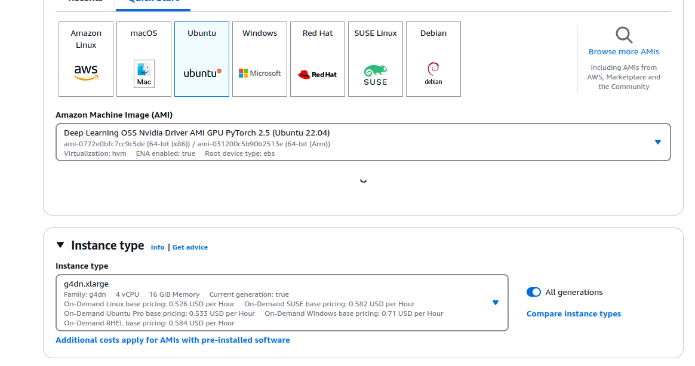
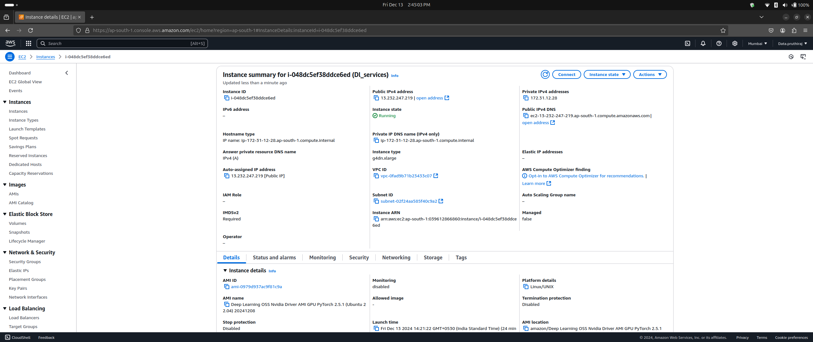
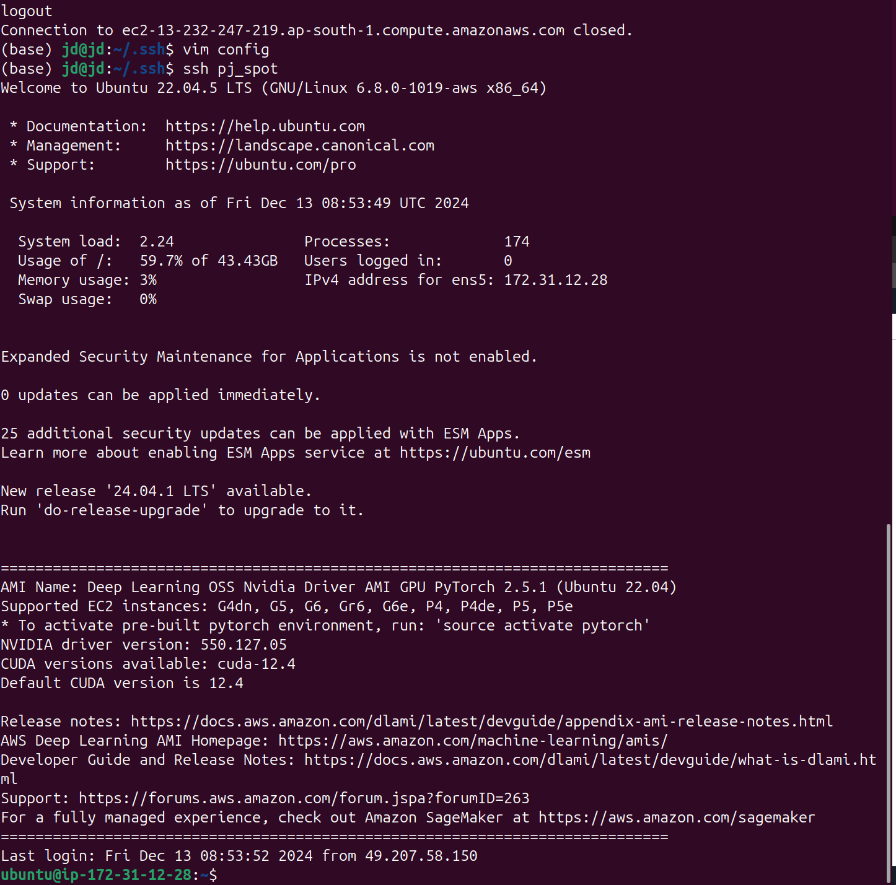
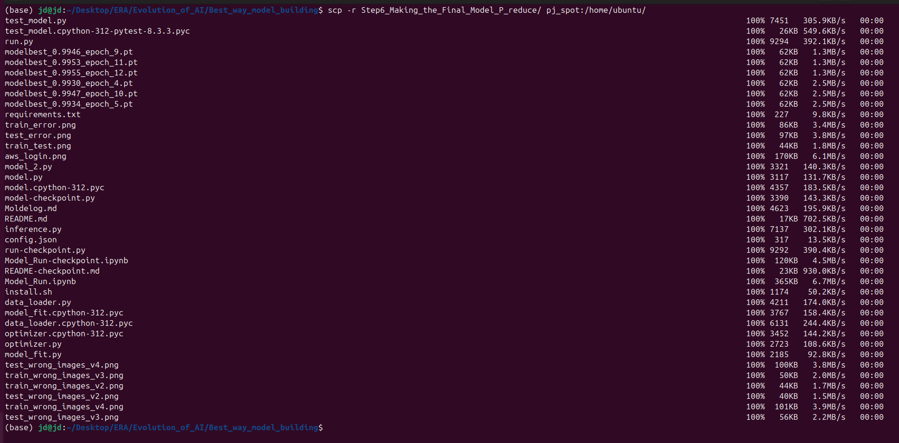
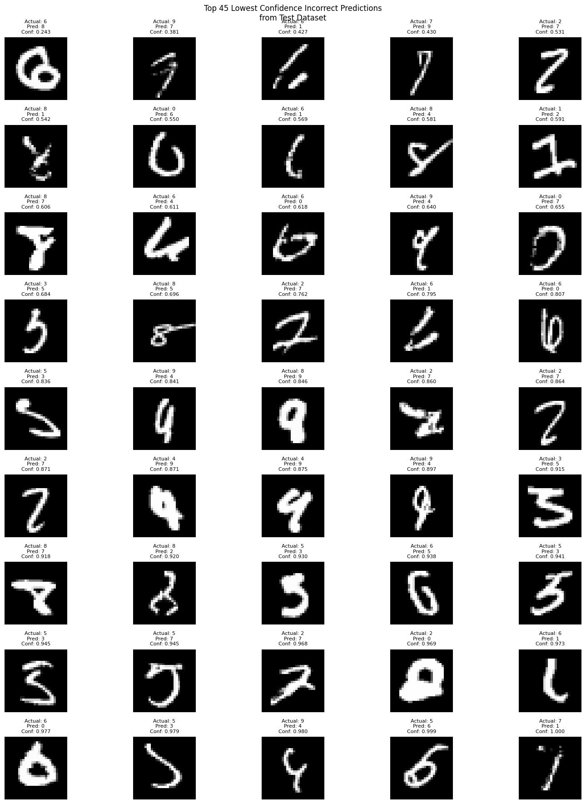

# Achieved : 99.55 with Total params: 5,340

1. **99.4% (this must be consistently shown in your last few epochs, and not a one-time achievement)**
2. **Less than or equal to 15 Epochs**
3. **Less than 8000 Parameters**


# **Step by step approach** 

**Step 1: Make the Setup correct [Link Text](Step1_Make_setup_correct/README.md)**

**Step 2: Add Regularization [Link Text](Step2_Add_Regularization/README.md)**

**Step 3: Reduce parameter [Link Text](Step3_Reduce_parameter/README.md)**

**Step 4: Making the Final Model Parameter reduced Added LrFinder  [Link Text](Step5_Making_the_Final_Model_param/README.md)**

**Step 5: Go Beyond Receptive Field  68 [Link Text](Step6_Making_the_Final_Model_P_reduce/README.md)**


# Training in AWS EC2 instance 

Configured One AWS EC2 Spot as below Config 






I prefer to login to SSH  So configured the Host in my local Linux  and pushing the files using SCP





**Once login By the help of Shell script i was able to install the Packages from requirement.txt** 

```shell
#!/bin/bash

# Shell script to install Python dependencies from requirements.txt
# Function to check if a command exists

sudo apt-get update
sudo apt-get install python3-pip
sudo apt-get install python3.12-venv

sudo apt-get autoremove --purge
sudo apt-get clean

python3 -m venv era
source era/bin/activate

command_exists() {
    command -v "$1" >/dev/null 2>&1
}

# Check if Python is installed
if ! command_exists python3; then
    echo "Python3 is not installed. Please install Python3 and try again."
    exit 1
fi

# Check if pip is installed
if ! command_exists pip3; then
    echo "pip is not installed. Installing pip..."
    python3 -m ensurepip --upgrade || { echo "Failed to install pip. Exiting."; exit 1; }
fi

# Upgrade pip
echo "Upgrading pip..."
pip3 install --upgrade pip

# Install requirements
if [ -f "requirements.txt" ]; then
    echo "Installing dependencies from requirements.txt..."
    pip3 install -r requirements.txt || { echo "Failed to install some dependencies."; exit 1; }
    echo "Dependencies installed successfully."
else
    echo "requirements.txt not found. Exiting."
    exit 1
fi

pip install https://download.pytorch.org/whl/cu118
```


Training Starts with simple script as python3 run.py


Below  is the Full Log:

```bash
(era) ubuntu@ip-172-31-12-28:~/Step6_Making_the_Final_Model_P_reduce$ python3 run.py 
Downloading http://yann.lecun.com/exdb/mnist/train-images-idx3-ubyte.gz
Failed to download (trying next):
HTTP Error 403: Forbidden

Downloading https://ossci-datasets.s3.amazonaws.com/mnist/train-images-idx3-ubyte.gz
Downloading https://ossci-datasets.s3.amazonaws.com/mnist/train-images-idx3-ubyte.gz to .data/MNIST/raw/train-images-idx3-ubyte.gz
100%|████████████████████████████████████████████████████████████████████████████████████████████████████| 9.91M/9.91M [00:02<00:00, 4.69MB/s]
Extracting .data/MNIST/raw/train-images-idx3-ubyte.gz to .data/MNIST/raw

Downloading http://yann.lecun.com/exdb/mnist/train-labels-idx1-ubyte.gz
Failed to download (trying next):
HTTP Error 403: Forbidden

Downloading https://ossci-datasets.s3.amazonaws.com/mnist/train-labels-idx1-ubyte.gz
Downloading https://ossci-datasets.s3.amazonaws.com/mnist/train-labels-idx1-ubyte.gz to .data/MNIST/raw/train-labels-idx1-ubyte.gz
100%|█████████████████████████████████████████████████████████████████████████████████████████████████████| 28.9k/28.9k [00:00<00:00, 157kB/s]
Extracting .data/MNIST/raw/train-labels-idx1-ubyte.gz to .data/MNIST/raw

Downloading http://yann.lecun.com/exdb/mnist/t10k-images-idx3-ubyte.gz
Failed to download (trying next):
HTTP Error 403: Forbidden

Downloading https://ossci-datasets.s3.amazonaws.com/mnist/t10k-images-idx3-ubyte.gz
Downloading https://ossci-datasets.s3.amazonaws.com/mnist/t10k-images-idx3-ubyte.gz to .data/MNIST/raw/t10k-images-idx3-ubyte.gz
100%|████████████████████████████████████████████████████████████████████████████████████████████████████| 1.65M/1.65M [00:01<00:00, 1.28MB/s]
Extracting .data/MNIST/raw/t10k-images-idx3-ubyte.gz to .data/MNIST/raw

Downloading http://yann.lecun.com/exdb/mnist/t10k-labels-idx1-ubyte.gz
Failed to download (trying next):
HTTP Error 403: Forbidden

Downloading https://ossci-datasets.s3.amazonaws.com/mnist/t10k-labels-idx1-ubyte.gz
Downloading https://ossci-datasets.s3.amazonaws.com/mnist/t10k-labels-idx1-ubyte.gz to .data/MNIST/raw/t10k-labels-idx1-ubyte.gz
100%|████████████████████████████████████████████████████████████████████████████████████████████████████| 4.54k/4.54k [00:00<00:00, 20.0MB/s]
Extracting .data/MNIST/raw/t10k-labels-idx1-ubyte.gz to .data/MNIST/raw

100%|█████████████████████████████████████████████████████████████████████████████████████████████████████| 1500/1500 [00:52<00:00, 28.71it/s]
Learning rate search finished. See the graph with {finder_name}.plot()
LR suggestion: steepest gradient
Suggested LR: 1.05E-01
Loss: 0.08217247137459123 LR: 0.10512313373669245
[0.10512313373669245]
----------------------------------------------------------------
        Layer (type)               Output Shape         Param #
================================================================
            Conv2d-1           [-1, 10, 26, 26]              90
       BatchNorm2d-2           [-1, 10, 26, 26]              20
              ReLU-3           [-1, 10, 26, 26]               0
           Dropout-4           [-1, 10, 26, 26]               0
            Conv2d-5           [-1, 10, 24, 24]             900
       BatchNorm2d-6           [-1, 10, 24, 24]              20
              ReLU-7           [-1, 10, 24, 24]               0
           Dropout-8           [-1, 10, 24, 24]               0
            Conv2d-9           [-1, 15, 22, 22]           1,350
      BatchNorm2d-10           [-1, 15, 22, 22]              30
             ReLU-11           [-1, 15, 22, 22]               0
          Dropout-12           [-1, 15, 22, 22]               0
        MaxPool2d-13           [-1, 15, 11, 11]               0
           Conv2d-14           [-1, 10, 11, 11]             150
      BatchNorm2d-15           [-1, 10, 11, 11]              20
             ReLU-16           [-1, 10, 11, 11]               0
          Dropout-17           [-1, 10, 11, 11]               0
           Conv2d-18             [-1, 10, 9, 9]             900
      BatchNorm2d-19             [-1, 10, 9, 9]              20
             ReLU-20             [-1, 10, 9, 9]               0
          Dropout-21             [-1, 10, 9, 9]               0
           Conv2d-22             [-1, 10, 7, 7]             900
      BatchNorm2d-23             [-1, 10, 7, 7]              20
             ReLU-24             [-1, 10, 7, 7]               0
          Dropout-25             [-1, 10, 7, 7]               0
           Conv2d-26             [-1, 10, 5, 5]             900
      BatchNorm2d-27             [-1, 10, 5, 5]              20
             ReLU-28             [-1, 10, 5, 5]               0
          Dropout-29             [-1, 10, 5, 5]               0
AdaptiveAvgPool2d-30             [-1, 10, 1, 1]               0
================================================================
Total params: 5,340
Trainable params: 5,340
Non-trainable params: 0
----------------------------------------------------------------
Input size (MB): 0.00
Forward/backward pass size (MB): 0.70
Params size (MB): 0.02
Estimated Total Size (MB): 0.73
----------------------------------------------------------------
None
Train ==> Epochs: 0 Batch:  468 loss: 0.07435842603445053 Accuracy: 93.55% : 100%|██████████████████████████| 469/469 [00:16<00:00, 28.87it/s]
Test ==> Epochs: 0 Batch:  78 loss: 0.04681931144967675 Accuracy: 98.60% : 100%|██████████████████████████████| 79/79 [00:01<00:00, 66.69it/s]
Insufficient test accuracy data.
LR: 0.10512313373669245

Train ==> Epochs: 1 Batch:  468 loss: 0.08549106121063232 Accuracy: 97.24% : 100%|██████████████████████████| 469/469 [00:16<00:00, 28.95it/s]
Test ==> Epochs: 1 Batch:  78 loss: 0.03777276965342462 Accuracy: 98.83% : 100%|██████████████████████████████| 79/79 [00:01<00:00, 66.48it/s]
Conditions not met for saving the model.
LR: 0.10512313373669245

Train ==> Epochs: 2 Batch:  468 loss: 0.04890625551342964 Accuracy: 97.56% : 100%|██████████████████████████| 469/469 [00:16<00:00, 28.94it/s]
Test ==> Epochs: 2 Batch:  78 loss: 0.032260946580767634 Accuracy: 99.02% : 100%|█████████████████████████████| 79/79 [00:01<00:00, 66.80it/s]
Conditions not met for saving the model.
LR: 0.10512313373669245

Train ==> Epochs: 3 Batch:  468 loss: 0.10106357932090759 Accuracy: 97.82% : 100%|██████████████████████████| 469/469 [00:16<00:00, 28.87it/s]
Test ==> Epochs: 3 Batch:  78 loss: 0.026358474833518268 Accuracy: 99.27% : 100%|█████████████████████████████| 79/79 [00:01<00:00, 66.52it/s]
Conditions not met for saving the model.
LR: 0.10512313373669245

Train ==> Epochs: 4 Batch:  468 loss: 0.026167331263422966 Accuracy: 97.94% : 100%|█████████████████████████| 469/469 [00:16<00:00, 28.47it/s]
Test ==> Epochs: 4 Batch:  78 loss: 0.02597363870739937 Accuracy: 99.26% : 100%|██████████████████████████████| 79/79 [00:01<00:00, 66.26it/s]
Conditions not met for saving the model.
LR: 0.10512313373669245

Train ==> Epochs: 5 Batch:  468 loss: 0.03419866785407066 Accuracy: 97.96% : 100%|██████████████████████████| 469/469 [00:16<00:00, 28.58it/s]
Test ==> Epochs: 5 Batch:  78 loss: 0.02787074487283826 Accuracy: 99.15% : 100%|██████████████████████████████| 79/79 [00:01<00:00, 66.55it/s]
Conditions not met for saving the model.
LR: 0.10512313373669245

Train ==> Epochs: 6 Batch:  468 loss: 0.10570023208856583 Accuracy: 98.14% : 100%|██████████████████████████| 469/469 [00:16<00:00, 28.40it/s]
Test ==> Epochs: 6 Batch:  78 loss: 0.022025825706589966 Accuracy: 99.24% : 100%|█████████████████████████████| 79/79 [00:01<00:00, 65.17it/s]
Conditions not met for saving the model.
LR: 0.10512313373669245

Train ==> Epochs: 7 Batch:  468 loss: 0.14109759032726288 Accuracy: 98.23% : 100%|██████████████████████████| 469/469 [00:16<00:00, 28.54it/s]
Test ==> Epochs: 7 Batch:  78 loss: 0.018743320024013518 Accuracy: 99.41% : 100%|█████████████████████████████| 79/79 [00:01<00:00, 65.24it/s]
Target Achieved: 99.41% Test Accuracy!!
LR: 0.10512313373669245

Train ==> Epochs: 8 Batch:  468 loss: 0.026286490261554718 Accuracy: 98.28% : 100%|█████████████████████████| 469/469 [00:16<00:00, 28.49it/s]
Test ==> Epochs: 8 Batch:  78 loss: 0.020434861610084773 Accuracy: 99.46% : 100%|█████████████████████████████| 79/79 [00:01<00:00, 65.36it/s]
Target Achieved: 99.46% Test Accuracy!!
LR: 0.10512313373669245

Train ==> Epochs: 9 Batch:  468 loss: 0.27364593744277954 Accuracy: 98.27% : 100%|██████████████████████████| 469/469 [00:16<00:00, 28.47it/s]
Test ==> Epochs: 9 Batch:  78 loss: 0.02126700376868248 Accuracy: 99.31% : 100%|██████████████████████████████| 79/79 [00:01<00:00, 65.24it/s]
Conditions not met for saving the model.
LR: 0.010512313373669245

Train ==> Epochs: 10 Batch:  468 loss: 0.016312947496771812 Accuracy: 98.51% : 100%|████████████████████████| 469/469 [00:16<00:00, 28.36it/s]
Test ==> Epochs: 10 Batch:  78 loss: 0.01760070739146322 Accuracy: 99.44% : 100%|█████████████████████████████| 79/79 [00:01<00:00, 66.97it/s]
Conditions not met for saving the model.
LR: 0.010512313373669245

Train ==> Epochs: 11 Batch:  468 loss: 0.036744456738233566 Accuracy: 98.62% : 100%|████████████████████████| 469/469 [00:16<00:00, 28.47it/s]
Test ==> Epochs: 11 Batch:  78 loss: 0.01742572971335612 Accuracy: 99.48% : 100%|█████████████████████████████| 79/79 [00:01<00:00, 67.50it/s]
Target Achieved: 99.48% Test Accuracy!!
LR: 0.010512313373669245

Train ==> Epochs: 12 Batch:  468 loss: 0.04616251215338707 Accuracy: 98.63% : 100%|█████████████████████████| 469/469 [00:16<00:00, 28.61it/s]
Test ==> Epochs: 12 Batch:  78 loss: 0.017792104828730226 Accuracy: 99.47% : 100%|████████████████████████████| 79/79 [00:01<00:00, 67.44it/s]
Conditions not met for saving the model.
LR: 0.0010512313373669247

Train ==> Epochs: 13 Batch:  468 loss: 0.04418128728866577 Accuracy: 98.69% : 100%|█████████████████████████| 469/469 [00:16<00:00, 28.56it/s]
Test ==> Epochs: 13 Batch:  78 loss: 0.016657220529729965 Accuracy: 99.48% : 100%|████████████████████████████| 79/79 [00:01<00:00, 67.45it/s]
Conditions not met for saving the model.
LR: 0.0010512313373669247

Train ==> Epochs: 14 Batch:  468 loss: 0.02963978610932827 Accuracy: 98.65% : 100%|█████████████████████████| 469/469 [00:16<00:00, 28.54it/s]
Test ==> Epochs: 14 Batch:  78 loss: 0.01741125149652362 Accuracy: 99.45% : 100%|█████████████████████████████| 79/79 [00:01<00:00, 65.72it/s]
Conditions not met for saving the model.
LR: 0.0010512313373669247

Max Train Accuracy:  0.9869
Max Test Accuracy:  0.9948
(era) ubuntu@ip-172-31-12-28:~/Step6_Making_the_Final_Model_P_reduce$ hostname -f
ip-172-31-12-28.ap-south-1.compute.internal
(era) ubuntu@ip-172-31-12-28:~/Step6_Making_the_Final_Model_P_reduce$ Connection to ec2-13-232-247-219.ap-south-1.compute.amazonaws.com closed by remote host.
Connection to ec2-13-232-247-219.ap-south-1.compute.amazonaws.com closed.
(base) jd@jd:~$ 

```

# Local Ubuntu Log 


```python
----------------------------------------------------------------
        Layer (type)               Output Shape         Param #
================================================================
            Conv2d-1           [-1, 10, 26, 26]              90
       BatchNorm2d-2           [-1, 10, 26, 26]              20
              ReLU-3           [-1, 10, 26, 26]               0
           Dropout-4           [-1, 10, 26, 26]               0
            Conv2d-5           [-1, 10, 24, 24]             900
       BatchNorm2d-6           [-1, 10, 24, 24]              20
              ReLU-7           [-1, 10, 24, 24]               0
           Dropout-8           [-1, 10, 24, 24]               0
            Conv2d-9           [-1, 15, 22, 22]           1,350
      BatchNorm2d-10           [-1, 15, 22, 22]              30
             ReLU-11           [-1, 15, 22, 22]               0
          Dropout-12           [-1, 15, 22, 22]               0
        MaxPool2d-13           [-1, 15, 11, 11]               0
           Conv2d-14           [-1, 10, 11, 11]             150
      BatchNorm2d-15           [-1, 10, 11, 11]              20
             ReLU-16           [-1, 10, 11, 11]               0
          Dropout-17           [-1, 10, 11, 11]               0
           Conv2d-18             [-1, 10, 9, 9]             900
      BatchNorm2d-19             [-1, 10, 9, 9]              20
             ReLU-20             [-1, 10, 9, 9]               0
          Dropout-21             [-1, 10, 9, 9]               0
           Conv2d-22             [-1, 10, 7, 7]             900
      BatchNorm2d-23             [-1, 10, 7, 7]              20
             ReLU-24             [-1, 10, 7, 7]               0
          Dropout-25             [-1, 10, 7, 7]               0
           Conv2d-26             [-1, 10, 5, 5]             900
      BatchNorm2d-27             [-1, 10, 5, 5]              20
             ReLU-28             [-1, 10, 5, 5]               0
          Dropout-29             [-1, 10, 5, 5]               0
AdaptiveAvgPool2d-30             [-1, 10, 1, 1]               0
================================================================
Total params: 5,340
Trainable params: 5,340
Non-trainable params: 0
----------------------------------------------------------------
Input size (MB): 0.00
Forward/backward pass size (MB): 0.70
Params size (MB): 0.02
Estimated Total Size (MB): 0.73
----------------------------------------------------------------
```

```python
Train ==> Epochs: 0 Batch:  468 loss: 0.08429612964391708 Accuracy: 93.73% : 100%|██████████████████████████| 469/469 [00:10<00:00, 43.06it/s]
Test ==> Epochs: 0 Batch:  78 loss: 0.04751643937379122 Accuracy: 98.44% : 100%|█████████████████████████████| 79/79 [00:00<00:00, 139.67it/s]
Insufficient test accuracy data.
LR: 0.10470379786343671
Train ==> Epochs: 1 Batch:  468 loss: 0.07999590039253235 Accuracy: 97.16% : 100%|██████████████████████████| 469/469 [00:11<00:00, 41.78it/s]
Test ==> Epochs: 1 Batch:  78 loss: 0.04003035141229629 Accuracy: 98.68% : 100%|█████████████████████████████| 79/79 [00:00<00:00, 140.92it/s]
Conditions not met for saving the model.
LR: 0.10470379786343671
Train ==> Epochs: 2 Batch:  468 loss: 0.06669685989618301 Accuracy: 97.56% : 100%|██████████████████████████| 469/469 [00:11<00:00, 41.87it/s]
Test ==> Epochs: 2 Batch:  78 loss: 0.038444595198333265 Accuracy: 98.84% : 100%|████████████████████████████| 79/79 [00:00<00:00, 141.99it/s]
Conditions not met for saving the model.
LR: 0.10470379786343671
Train ==> Epochs: 3 Batch:  468 loss: 0.05630810558795929 Accuracy: 97.83% : 100%|██████████████████████████| 469/469 [00:11<00:00, 41.81it/s]
Test ==> Epochs: 3 Batch:  78 loss: 0.027877245303243398 Accuracy: 99.13% : 100%|████████████████████████████| 79/79 [00:00<00:00, 135.12it/s]
Conditions not met for saving the model.
LR: 0.10470379786343671
Train ==> Epochs: 4 Batch:  468 loss: 0.06767883896827698 Accuracy: 97.93% : 100%|██████████████████████████| 469/469 [00:11<00:00, 41.73it/s]
Test ==> Epochs: 4 Batch:  78 loss: 0.02411178403198719 Accuracy: 99.30% : 100%|█████████████████████████████| 79/79 [00:00<00:00, 144.21it/s]
Target Achieved: 99.30% Test Accuracy!!
LR: 0.10470379786343671
Train ==> Epochs: 5 Batch:  468 loss: 0.03669905662536621 Accuracy: 98.07% : 100%|██████████████████████████| 469/469 [00:11<00:00, 41.66it/s]
Test ==> Epochs: 5 Batch:  78 loss: 0.02256702058017254 Accuracy: 99.34% : 100%|█████████████████████████████| 79/79 [00:00<00:00, 147.14it/s]
Target Achieved: 99.34% Test Accuracy!!
LR: 0.10470379786343671
Train ==> Epochs: 6 Batch:  468 loss: 0.08133464306592941 Accuracy: 98.09% : 100%|██████████████████████████| 469/469 [00:11<00:00, 41.29it/s]
Test ==> Epochs: 6 Batch:  78 loss: 0.02199115399904549 Accuracy: 99.32% : 100%|█████████████████████████████| 79/79 [00:00<00:00, 141.89it/s]
Conditions not met for saving the model.
LR: 0.10470379786343671
Train ==> Epochs: 7 Batch:  468 loss: 0.07088207453489304 Accuracy: 98.23% : 100%|██████████████████████████| 469/469 [00:09<00:00, 47.08it/s]
Test ==> Epochs: 7 Batch:  78 loss: 0.022306216959655286 Accuracy: 99.29% : 100%|████████████████████████████| 79/79 [00:00<00:00, 143.57it/s]
Conditions not met for saving the model.
LR: 0.10470379786343671
Train ==> Epochs: 8 Batch:  468 loss: 0.04231416806578636 Accuracy: 98.25% : 100%|██████████████████████████| 469/469 [00:11<00:00, 41.12it/s]
Test ==> Epochs: 8 Batch:  78 loss: 0.021874626899976282 Accuracy: 99.27% : 100%|████████████████████████████| 79/79 [00:00<00:00, 144.17it/s]
Conditions not met for saving the model.
LR: 0.010470379786343673
Train ==> Epochs: 9 Batch:  468 loss: 0.14019548892974854 Accuracy: 98.48% : 100%|██████████████████████████| 469/469 [00:11<00:00, 41.67it/s]
Test ==> Epochs: 9 Batch:  78 loss: 0.018106948681175707 Accuracy: 99.46% : 100%|████████████████████████████| 79/79 [00:00<00:00, 141.57it/s]
Target Achieved: 99.46% Test Accuracy!!
LR: 0.010470379786343673
Train ==> Epochs: 10 Batch:  468 loss: 0.017599599435925484 Accuracy: 98.57% : 100%|████████████████████████| 469/469 [00:11<00:00, 41.57it/s]
Test ==> Epochs: 10 Batch:  78 loss: 0.01723082539178431 Accuracy: 99.47% : 100%|████████████████████████████| 79/79 [00:00<00:00, 147.60it/s]
Target Achieved: 99.47% Test Accuracy!!
LR: 0.010470379786343673
Train ==> Epochs: 11 Batch:  468 loss: 0.01653793454170227 Accuracy: 98.59% : 100%|█████████████████████████| 469/469 [00:11<00:00, 41.91it/s]
Test ==> Epochs: 11 Batch:  78 loss: 0.016916205030865966 Accuracy: 99.53% : 100%|███████████████████████████| 79/79 [00:00<00:00, 133.54it/s]
Target Achieved: 99.53% Test Accuracy!!
LR: 0.010470379786343673
Train ==> Epochs: 12 Batch:  468 loss: 0.043063029646873474 Accuracy: 98.57% : 100%|████████████████████████| 469/469 [00:11<00:00, 40.89it/s]
Test ==> Epochs: 12 Batch:  78 loss: 0.018190599500015378 Accuracy: 99.55% : 100%|███████████████████████████| 79/79 [00:00<00:00, 143.95it/s]
Target Achieved: 99.55% Test Accuracy!!
LR: 0.010470379786343673
Train ==> Epochs: 13 Batch:  468 loss: 0.06336142867803574 Accuracy: 98.61% : 100%|█████████████████████████| 469/469 [00:11<00:00, 41.28it/s]
Test ==> Epochs: 13 Batch:  78 loss: 0.016056551749701612 Accuracy: 99.55% : 100%|███████████████████████████| 79/79 [00:00<00:00, 142.16it/s]
Conditions not met for saving the model.
LR: 0.010470379786343673
Train ==> Epochs: 14 Batch:  468 loss: 0.025118166580796242 Accuracy: 98.62% : 100%|████████████████████████| 469/469 [00:11<00:00, 41.65it/s]
Test ==> Epochs: 14 Batch:  78 loss: 0.017048460460454225 Accuracy: 99.55% : 100%|███████████████████████████| 79/79 [00:00<00:00, 147.96it/s]
Conditions not met for saving the model.
LR: 0.010470379786343673
```

```python
Max Train Accuracy:  0.98625
Max Test Accuracy:  0.9955
```

Dilation is a technique used in convolutional layers to expand the receptive field without increasing the number of parameters or performing pooling. It works by introducing spaces between kernel elements.

- **Dilation Rate:** Determines the spacing between kernel elements. A dilation rate of ddd means the kernel operates on every ddd-th pixel in both height and width.
- Advantages:
  - Larger receptive field without increasing kernel size or the number of layers.
  - Useful in tasks like semantic segmentation and where capturing context is important.
- **Formula for Output Size with Dilation:** Output Size=Input Size+2×Padding−Dilation×(Kernel Size−1)−1Stride+1\text{Output Size} = \frac{\text{Input Size} + 2 \times \text{Padding} - \text{Dilation} \times (\text{Kernel Size} - 1) - 1}{\text{Stride}} + 1Output Size=StrideInput Size+2×Padding−Dilation×(Kernel Size−1)−1+1


# Infrencing

```python
2024-12-12 22:32:43,622 - INFO - Loading configuration...
2024-12-12 22:32:43,628 - INFO - Using device: cuda
2024-12-12 22:32:43,725 - INFO - Loading model: modelbest_0.9955_epoch_12.pt
2024-12-12 22:32:43,734 - INFO - Model loaded successfully.
2024-12-12 22:32:52,800 - INFO - Starting validation on train dataset...
Validating train: 100%|██████████████████████████████████████████████████████████████████████████████████| 469/469 [00:16<00:00, 29.22batch/s]
2024-12-12 22:33:08,851 - INFO - Number of incorrect predictions in train dataset: 610
2024-12-12 22:33:08,852 - INFO - Starting validation on test dataset...
Validating test: 100%|█████████████████████████████████████████████████████████████████████████████████████| 79/79 [00:01<00:00, 67.42batch/s]
2024-12-12 22:33:10,025 - INFO - Number of incorrect predictions in test dataset: 45
```




# The model Architecture 

1> **Input Block:**

- Initial convolution layer with 10 filters, kernel size 3×33 \times 33×3, and no padding.
- ReLU activation, BatchNorm, and Dropout are used for regularization.

2> **Convolution Block 1:**

- Three sequential convolution layers increase the depth and complexity of features extracted.
- Final layer increases the channel count to 15.

3> **Transition Block 1:**

- MaxPooling reduces spatial dimensions to half, controlling the computation and overfitting.
- 1×11 \times 11×1 convolution reduces the channel count back to 10.

4> **Convolution Block 2 with Dilation:**

- Three dilated convolution layers extract features with a progressively increasing receptive field.
- Each layer maintains the same spatial dimensions using padding.

5> **GAP Layer:**

- Global Average Pooling (GAP) reduces spatial dimensions to 1×11 \times 11×1 while preserving the depth.

6> **Final Output:**

- The model outputs logits for 10 classes using F.log_softmaxF.log\_softmaxF.log_softmax.

```python
class Net(nn.Module):
def __init__(self):
    super(Net, self).__init__()
    self.dropout_value = 0.03
    # Input Block
    self.convblock1 = nn.Sequential(
          nn.Conv2d(in_channels=1, out_channels=10, kernel_size=(3, 3), padding=0, bias=False),
          nn.BatchNorm2d(10),
          nn.ReLU(),
          nn.Dropout(self.dropout_value)  
       ) 
    self.convblock2 = nn.Sequential(
        nn.Conv2d(in_channels=10, out_channels=10, kernel_size=(3, 3), padding=0, bias=False),
        nn.BatchNorm2d(10),
        nn.ReLU(),
        nn.Dropout(self.dropout_value)
    ) 
    self.convblock3 = nn.Sequential(
        nn.Conv2d(in_channels=10, out_channels=15, kernel_size=(3, 3), padding=0, bias=False),
        nn.BatchNorm2d(15),
        nn.ReLU(),
        nn.Dropout(self.dropout_value)
    ) 

    # TRANSITION BLOCK 1
    self.pool1 = nn.MaxPool2d(2, 2)
    
    self.convblock4 = nn.Sequential(
        nn.Conv2d(in_channels=15, out_channels=10, kernel_size=(1, 1), padding=0, bias=False),
        nn.BatchNorm2d(10),
        nn.ReLU(),
        nn.Dropout(self.dropout_value)
    ) 

    # CONVOLUTION BLOCK 2 with dilation
    self.convblock5 = nn.Sequential(
        nn.Conv2d(in_channels=10, out_channels=10, kernel_size=(3, 3), padding=1, bias=False, dilation=2),
        nn.BatchNorm2d(10),
        nn.ReLU(),
        nn.Dropout(self.dropout_value)
    ) 
    self.convblock6 = nn.Sequential(
        nn.Conv2d(in_channels=10, out_channels=10, kernel_size=(3, 3), padding=1, bias=False, dilation=2),
        nn.BatchNorm2d(10),
        nn.ReLU(),
        nn.Dropout(self.dropout_value)
    ) 
    self.convblock7 = nn.Sequential(
        nn.Conv2d(in_channels=10, out_channels=10, kernel_size=(3, 3), padding=1, bias=False, dilation=2),
        nn.BatchNorm2d(10),
        nn.ReLU(),
        nn.Dropout(self.dropout_value)
    )
    
    # GAP Layer
    self.gap = nn.AdaptiveAvgPool2d(1) # input_size = 5 output_size = 1

def forward(self, x):
    x = self.convblock1(x)
    x = self.convblock2(x)
    x = self.convblock3(x)
    x = self.pool1(x)
    x = self.convblock4(x)
    x = self.convblock5(x)
    x = self.convblock6(x)
    x = self.convblock7(x)
    x = self.gap(x)
    x = x.view(-1, 10)
    return F.log_softmax(x, dim=-1)
```

| Layer              | Input Size | Kernel Size | Padding | Dilation | Stride | Output Size | Receptive Field | RF Formula                                |
| ------------------ | ---------- | ----------- | ------- | -------- | ------ | ----------- | --------------- | ----------------------------------------- |
| Input              | 28         | -           | -       | -        | -      | 28          | 1               | -                                         |
| Conv1 (convblock1) | 28         | 3           | 0       | 1        | 1      | 26          | 3               | 1+(3−1)×11 + (3 - 1) \times 11+(3−1)×1    |
| Conv2 (convblock2) | 26         | 3           | 0       | 1        | 1      | 24          | 5               | 3+(3−1)×13 + (3 - 1) \times 13+(3−1)×1    |
| Conv3 (convblock3) | 24         | 3           | 0       | 1        | 1      | 22          | 7               | 5+(3−1)×15 + (3 - 1) \times 15+(3−1)×1    |
| MaxPool1           | 22         | 2           | 0       | 1        | 2      | 11          | 15              | 7+(2−1)×27 + (2 - 1) \times 27+(2−1)×2    |
| Conv4 (convblock4) | 11         | 1           | 0       | 1        | 1      | 11          | 15              | 15+(1−1)×115 + (1 - 1) \times 115+(1−1)×1 |
| Conv5 (convblock5) | 11         | 3           | 1       | 2        | 1      | 11          | 19              | 15+(3−1)×215 + (3 - 1) \times 215+(3−1)×2 |
| Conv6 (convblock6) | 11         | 3           | 1       | 2        | 1      | 11          | 27              | 19+(3−1)×219 + (3 - 1) \times 219+(3−1)×2 |
| Conv7 (convblock7) | 11         | 3           | 1       | 2        | 1      | 11          | 35              | 27+(3−1)×227 + (3 - 1) \times 227+(3−1)×2 |
| GAP                | 11         | 11          | 0       | 1        | 1      | 1           | 67              | Covers entire input                       |
