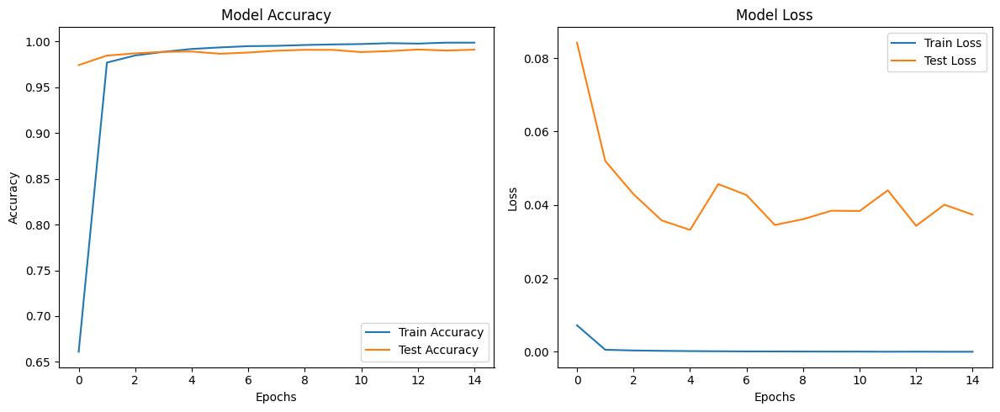

# Target: Build a Structure that Works Well Without all error. 


Go to main Read me : [Link Text](README.md)


# The model 

The model is planned to Have a correct structure where

1> The Input and output is taken care of

2> The Structures of model is designed to reach the correct receptive filed needed 

3>  **Total Parameters**: 509,946  ,**Trainable Parameters:** 509,946

```python
----------------------------------------------------------------
        Layer (type)               Output Shape         Param #
================================================================
            Conv2d-1           [-1, 32, 26, 26]             320
              ReLU-2           [-1, 32, 26, 26]               0
            Conv2d-3           [-1, 64, 24, 24]          18,496
              ReLU-4           [-1, 64, 24, 24]               0
            Conv2d-5          [-1, 128, 22, 22]          73,856
              ReLU-6          [-1, 128, 22, 22]               0
         MaxPool2d-7          [-1, 128, 11, 11]               0
            Conv2d-8           [-1, 16, 11, 11]           2,064
              ReLU-9           [-1, 16, 11, 11]               0
           Conv2d-10             [-1, 32, 9, 9]           4,640
             ReLU-11             [-1, 32, 9, 9]               0
           Conv2d-12             [-1, 64, 7, 7]          18,496
             ReLU-13             [-1, 64, 7, 7]               0
           Conv2d-14            [-1, 128, 5, 5]          73,856
             ReLU-15            [-1, 128, 5, 5]               0
           Conv2d-16            [-1, 256, 3, 3]         295,168
             ReLU-17            [-1, 256, 3, 3]               0
           Conv2d-18             [-1, 10, 1, 1]          23,050
================================================================
Total params: 509,946
Trainable params: 509,946
Non-trainable params: 0
----------------------------------------------------------------
Input size (MB): 0.00
Forward/backward pass size (MB): 2.16
Params size (MB): 1.95
Estimated Total Size (MB): 4.11
----------------------------------------------------------------
```


```python
=======================================Reciptive Field Calculator========================================
|    | Kernel_size   | Padding   |   Stride | Input_Img_size   | Output_Img_size   | Receptive_field   |
|---:|:--------------|:----------|---------:|:-----------------|:------------------|:------------------|
|  0 | 3*3           | NO        |        1 | 28*28            | 26*26             | 3*3               |
|  1 | 3*3           | NO        |        1 | 26*26            | 24*24             | 5*5               |
|  2 | 3*3           | NO        |        1 | 24*24            | 22*22             | 7*7               |
|  3 | 2*2           | NO        |        2 | 22*22            | 11*11             | 8*8               |
|  4 | 1*1           | NO        |        1 | 11*11            | 11*11             | 8*8               |
|  5 | 3*3           | NO        |        1 | 11*11            | 9*9               | 12*12             |
|  6 | 3*3           | NO        |        1 | 9*9              | 7*7               | 16*16             |
|  7 | 3*3           | NO        |        1 | 7*7              | 5*5               | 20*20             |
|  8 | 3*3           | NO        |        1 | 5*5              | 3*3               | 24*24             |
|  9 | 3*3           | NO        |        1 | 3*3              | 1*1               | 28*28             |
=========================================================================================================
```

```python
%load config.json
{'seed': 5,
 'best_model': 0.993,
 'training': {'batch_size': 128,'epochs': 15,'start_lr': [0.1],'end_lr': [2],'loss_type': 'nll','use_scheduler': 0,
              'runlr_finer': 0,'scheduler_type': 'reducelronplateau','lr_iter': 4500 }
}
```


## **Purpose**

This model is designed for making the skeleton ready  a lightweight yet effective classification task, leveraging multiple convolution layers with ReLU activation and spatial reduction through Max Pooling. 

The final output layer is tailored for a 10-class classification problem.

The model uses a large number of trainable parameters, primarily concentrated in the deeper layers, to capture complex features. But is that  much parameter needed ?

Efficient use of pooling helps reduce computational costs while maintaining performance


# The Data

The data transformations used are below 

1. **Resize**:
   - Resizes images to a fixed size of 28x28 pixels.
3. **ToTensor**:
   - Converts images to PyTorch tensors.
4. **Normalize**:
   - Normalizes the tensor images using the calculated mean and standard deviation of the dataset.


# Training Model

```python
Train ==> Epochs: 0 Batch:  468 loss: 0.08617404848337173 Accuracy: 66.11% : 100%|█████████████████████████| 469/469 [00:04<00:00, 117.01it/s]
Test ==> Epochs: 0 Batch:  78 loss: 0.08421015005111694 Accuracy: 97.42% : 100%|█████████████████████████████| 79/79 [00:00<00:00, 179.31it/s]
Insufficient test accuracy data.
LR: 0.015
Train ==> Epochs: 1 Batch:  468 loss: 0.10812154412269592 Accuracy: 97.69% : 100%|█████████████████████████| 469/469 [00:03<00:00, 118.81it/s]
Test ==> Epochs: 1 Batch:  78 loss: 0.05198473695516586 Accuracy: 98.46% : 100%|█████████████████████████████| 79/79 [00:00<00:00, 187.24it/s]
Conditions not met for saving the model.
LR: 0.015
Train ==> Epochs: 2 Batch:  468 loss: 0.016674639657139778 Accuracy: 98.47% : 100%|████████████████████████| 469/469 [00:03<00:00, 119.14it/s]
Test ==> Epochs: 2 Batch:  78 loss: 0.042936698953807355 Accuracy: 98.70% : 100%|████████████████████████████| 79/79 [00:00<00:00, 184.02it/s]
Conditions not met for saving the model.
LR: 0.015
Train ==> Epochs: 3 Batch:  468 loss: 0.02534584514796734 Accuracy: 98.87% : 100%|█████████████████████████| 469/469 [00:03<00:00, 118.71it/s]
Test ==> Epochs: 3 Batch:  78 loss: 0.03578732824921608 Accuracy: 98.87% : 100%|█████████████████████████████| 79/79 [00:00<00:00, 182.51it/s]
Conditions not met for saving the model.
LR: 0.015
Train ==> Epochs: 4 Batch:  468 loss: 0.05977639928460121 Accuracy: 99.18% : 100%|█████████████████████████| 469/469 [00:03<00:00, 119.74it/s]
Test ==> Epochs: 4 Batch:  78 loss: 0.033214713237993417 Accuracy: 98.90% : 100%|████████████████████████████| 79/79 [00:00<00:00, 186.56it/s]
Conditions not met for saving the model.
LR: 0.015
Train ==> Epochs: 5 Batch:  468 loss: 0.008070157840847969 Accuracy: 99.35% : 100%|████████████████████████| 469/469 [00:03<00:00, 119.86it/s]
Test ==> Epochs: 5 Batch:  78 loss: 0.04567586617842317 Accuracy: 98.66% : 100%|█████████████████████████████| 79/79 [00:00<00:00, 184.84it/s]
Conditions not met for saving the model.
LR: 0.015
Train ==> Epochs: 6 Batch:  468 loss: 0.03185918182134628 Accuracy: 99.49% : 100%|█████████████████████████| 469/469 [00:03<00:00, 118.48it/s]
Test ==> Epochs: 6 Batch:  78 loss: 0.04269767736624926 Accuracy: 98.79% : 100%|█████████████████████████████| 79/79 [00:00<00:00, 190.18it/s]
Conditions not met for saving the model.
LR: 0.015
Train ==> Epochs: 7 Batch:  468 loss: 0.036038175225257874 Accuracy: 99.52% : 100%|████████████████████████| 469/469 [00:03<00:00, 118.95it/s]
Test ==> Epochs: 7 Batch:  78 loss: 0.034549376666918395 Accuracy: 98.99% : 100%|████████████████████████████| 79/79 [00:00<00:00, 191.88it/s]
Conditions not met for saving the model.
LR: 0.015
Train ==> Epochs: 8 Batch:  468 loss: 0.009144098497927189 Accuracy: 99.61% : 100%|████████████████████████| 469/469 [00:03<00:00, 119.18it/s]
Test ==> Epochs: 8 Batch:  78 loss: 0.036131849488447186 Accuracy: 99.09% : 100%|████████████████████████████| 79/79 [00:00<00:00, 185.93it/s]
Conditions not met for saving the model.
LR: 0.015
Train ==> Epochs: 9 Batch:  468 loss: 0.005339605268090963 Accuracy: 99.68% : 100%|████████████████████████| 469/469 [00:03<00:00, 119.08it/s]
Test ==> Epochs: 9 Batch:  78 loss: 0.03843004200365394 Accuracy: 99.08% : 100%|█████████████████████████████| 79/79 [00:00<00:00, 185.52it/s]
Conditions not met for saving the model.
LR: 0.015
Train ==> Epochs: 10 Batch:  468 loss: 0.003970857243984938 Accuracy: 99.72% : 100%|███████████████████████| 469/469 [00:03<00:00, 117.47it/s]
Test ==> Epochs: 10 Batch:  78 loss: 0.03836308538503945 Accuracy: 98.84% : 100%|████████████████████████████| 79/79 [00:00<00:00, 187.06it/s]
Conditions not met for saving the model.
LR: 0.015
Train ==> Epochs: 11 Batch:  468 loss: 0.0002452053886372596 Accuracy: 99.81% : 100%|██████████████████████| 469/469 [00:03<00:00, 118.32it/s]
Test ==> Epochs: 11 Batch:  78 loss: 0.044002002654969695 Accuracy: 98.95% : 100%|███████████████████████████| 79/79 [00:00<00:00, 180.42it/s]
Conditions not met for saving the model.
LR: 0.015
Train ==> Epochs: 12 Batch:  468 loss: 0.056639090180397034 Accuracy: 99.77% : 100%|███████████████████████| 469/469 [00:03<00:00, 118.55it/s]
Test ==> Epochs: 12 Batch:  78 loss: 0.03432349986943882 Accuracy: 99.12% : 100%|████████████████████████████| 79/79 [00:00<00:00, 192.49it/s]
Conditions not met for saving the model.
LR: 0.015
Train ==> Epochs: 13 Batch:  468 loss: 0.0054987515322864056 Accuracy: 99.87% : 100%|██████████████████████| 469/469 [00:03<00:00, 118.15it/s]
Test ==> Epochs: 13 Batch:  78 loss: 0.04008089121566154 Accuracy: 99.01% : 100%|████████████████████████████| 79/79 [00:00<00:00, 188.00it/s]
Conditions not met for saving the model.
LR: 0.015
Train ==> Epochs: 14 Batch:  468 loss: 0.0044244322925806046 Accuracy: 99.87% : 100%|██████████████████████| 469/469 [00:03<00:00, 117.85it/s]
Test ==> Epochs: 14 Batch:  78 loss: 0.03736125959418714 Accuracy: 99.10% : 100%|████████████████████████████| 79/79 [00:00<00:00, 184.32it/s]
Conditions not met for saving the model.
LR: 0.015
```




# Observations

The model Seems to be over fitting after 3 -4 epochs .May be because no regularization is applied yet  in the model. 

Also The parameters used in the model are huge . That leads to over fitting 


## What Next ?

Lets try putting some salt      .. 
