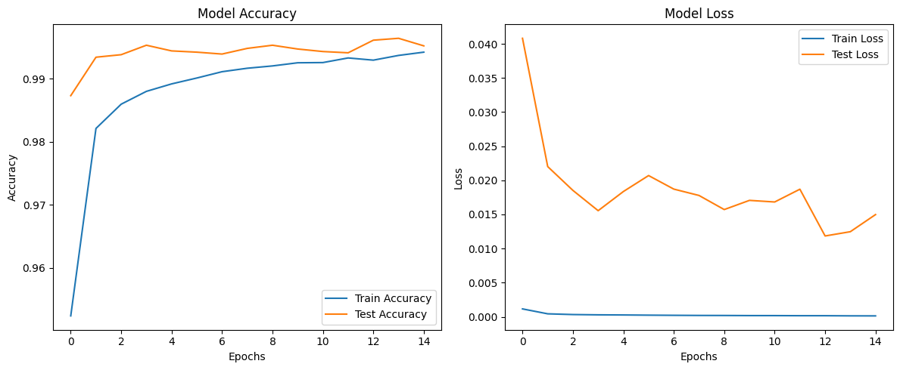

# Target: Add Regularization /Reduce Over fit

# 					

Go to main Read me : [Link Text](README.md)

# Model Architecture

**Added Batch Normalization**:

- Introduced after every convolution layer.
- Helps in stabilizing learning by normalizing activations, reducing internal covariate shift.
- Improved feature extraction through Batch Norm ensures better gradient flow and smoother loss landscape.
- BatchNorm reduces the risk of vanishing or exploding gradients, leading to more consistent training.

**Added Dropout**:

- Added after every activation layer (ReLU).
- Regularizes the model by preventing over fitting through random neuron deactivation during training.
- Dropout forces the network to not rely too heavily on specific activations.

**Parameter Count**:

- Slight increase in parameters from **509,946** to **511,386**, attributed to the Batch Norm layers (extra parameters for scaling and shifting).

```sql
----------------------------------------------------------------
        Layer (type)               Output Shape         Param #
================================================================
            Conv2d-1           [-1, 32, 26, 26]             320
       BatchNorm2d-2           [-1, 32, 26, 26]              64
              ReLU-3           [-1, 32, 26, 26]               0
           Dropout-4           [-1, 32, 26, 26]               0
            Conv2d-5           [-1, 64, 24, 24]          18,496
       BatchNorm2d-6           [-1, 64, 24, 24]             128
              ReLU-7           [-1, 64, 24, 24]               0
           Dropout-8           [-1, 64, 24, 24]               0
            Conv2d-9          [-1, 128, 22, 22]          73,856
      BatchNorm2d-10          [-1, 128, 22, 22]             256
             ReLU-11          [-1, 128, 22, 22]               0
          Dropout-12          [-1, 128, 22, 22]               0
        MaxPool2d-13          [-1, 128, 11, 11]               0
           Conv2d-14           [-1, 16, 11, 11]           2,064
      BatchNorm2d-15           [-1, 16, 11, 11]              32
             ReLU-16           [-1, 16, 11, 11]               0
          Dropout-17           [-1, 16, 11, 11]               0
           Conv2d-18             [-1, 32, 9, 9]           4,640
      BatchNorm2d-19             [-1, 32, 9, 9]              64
             ReLU-20             [-1, 32, 9, 9]               0
          Dropout-21             [-1, 32, 9, 9]               0
           Conv2d-22             [-1, 64, 7, 7]          18,496
      BatchNorm2d-23             [-1, 64, 7, 7]             128
             ReLU-24             [-1, 64, 7, 7]               0
          Dropout-25             [-1, 64, 7, 7]               0
           Conv2d-26            [-1, 128, 5, 5]          73,856
      BatchNorm2d-27            [-1, 128, 5, 5]             256
             ReLU-28            [-1, 128, 5, 5]               0
          Dropout-29            [-1, 128, 5, 5]               0
           Conv2d-30            [-1, 256, 3, 3]         295,168
      BatchNorm2d-31            [-1, 256, 3, 3]             512
             ReLU-32            [-1, 256, 3, 3]               0
          Dropout-33            [-1, 256, 3, 3]               0
           Conv2d-34             [-1, 10, 1, 1]          23,050
================================================================
Total params: 511,386
Trainable params: 511,386
Non-trainable params: 0
----------------------------------------------------------------
Input size (MB): 0.00
Forward/backward pass size (MB): 4.20
Params size (MB): 1.95
Estimated Total Size (MB): 6.15
----------------------------------------------------------------
=======================================Reciptive Field Calculator========================================
|    | Kernel_size   | Padding   |   Stride | Input_Img_size   | Output_Img_size   | Receptive_field   |
|---:|:--------------|:----------|---------:|:-----------------|:------------------|:------------------|
|  0 | 3*3           | NO        |        1 | 28*28            | 26*26             | 3*3               |
|  1 | 3*3           | NO        |        1 | 26*26            | 24*24             | 5*5               |
|  2 | 3*3           | NO        |        1 | 24*24            | 22*22             | 7*7               |
|  3 | 2*2           | NO        |        2 | 22*22            | 11*11             | 8*8               |
|  4 | 1*1           | NO        |        1 | 11*11            | 11*11             | 8*8               |
|  5 | 3*3           | NO        |        1 | 11*11            | 9*9               | 12*12             |
|  6 | 3*3           | NO        |        1 | 9*9              | 7*7               | 16*16             |
|  7 | 3*3           | NO        |        1 | 7*7              | 5*5               | 20*20             |
|  8 | 3*3           | NO        |        1 | 5*5              | 3*3               | 24*24             |
|  9 | 3*3           | NO        |        1 | 3*3              | 1*1               | 28*28             |
=========================================================================================================
```

# The Data

The data transformations used are below 

1. **Resize**:
   - Resizes images to a fixed size of 28x28 pixels.

2. **ToTensor**:
   - Converts images to PyTorch tensors.

3. **Normalize**:
   - Normalizes the tensor images using the calculated mean and standard deviation of the dataset.

4. **Random Perspective (commented out)**:
   - Applies random perspective transformations to the images.

5. **Random Rotation (commented out)**:
   - Rotates images randomly within a specified degree range.

I have Realized **<u>the Sequence of data transformation does matter</u>** here , Hence i have selected this sequence below:

```python
# Initialize transforms
self._train_transforms = transforms.Compose([
    transforms.Resize((28, 28)),#interpolation=transforms.InterpolationMode.NEAREST),
    transforms.RandomPerspective(distortion_scale=0.2, p=0.5, interpolation=transforms.InterpolationMode.NEAREST),
    transforms.RandomRotation(degrees=15, expand=False, center=None, fill=(self.mean) ),
    transforms.ToTensor(), 
    transforms.Normalize((self.mean,),
                          (self.std,)),
])
```

1> **Resize First**: 

​		Ensures uniformity in input size, which simplifies subsequent transformations and maintains consistency for the model.

2> **Augmentations Before Tensor Conversion**:

​		Operations like perspective distortion and rotation work best on the raw image format (PIL images) to avoid quality degradation.

3> **Tensor Conversion Before Normalization**:

​		Augmentations rely on pixel intensities, so applying `ToTensor` afterward ensures pixel values are prepared for further mathematical operations.

4> **Normalize Last**:

​		Normalization needs to be applied to the final tensor data so that the input is standardized just before the model processes it.

# Training Model

```python
Train ==> Epochs: 0 Batch:  468 loss: 0.08108838647603989 Accuracy: 95.24% : 100%|██████████████████████████| 469/469 [00:05<00:00, 89.38it/s]
Test ==> Epochs: 0 Batch:  78 loss: 0.04080878247022629 Accuracy: 98.73% : 100%|█████████████████████████████| 79/79 [00:00<00:00, 176.48it/s]
Insufficient test accuracy data.
LR: 0.015
Train ==> Epochs: 1 Batch:  468 loss: 0.12077921628952026 Accuracy: 98.21% : 100%|██████████████████████████| 469/469 [00:05<00:00, 89.85it/s]
Test ==> Epochs: 1 Batch:  78 loss: 0.022012031580507754 Accuracy: 99.34% : 100%|████████████████████████████| 79/79 [00:00<00:00, 186.04it/s]
Conditions not met for saving the model.
LR: 0.015
Train ==> Epochs: 2 Batch:  468 loss: 0.028777437284588814 Accuracy: 98.59% : 100%|█████████████████████████| 469/469 [00:05<00:00, 89.40it/s]
Test ==> Epochs: 2 Batch:  78 loss: 0.018520529718731995 Accuracy: 99.38% : 100%|████████████████████████████| 79/79 [00:00<00:00, 187.37it/s]
Conditions not met for saving the model.
LR: 0.015
Train ==> Epochs: 3 Batch:  468 loss: 0.006717060226947069 Accuracy: 98.80% : 100%|█████████████████████████| 469/469 [00:05<00:00, 90.02it/s]
Test ==> Epochs: 3 Batch:  78 loss: 0.015551951071294024 Accuracy: 99.53% : 100%|████████████████████████████| 79/79 [00:00<00:00, 188.30it/s]
Target Achieved: 99.53% Test Accuracy!!
LR: 0.015
Train ==> Epochs: 4 Batch:  468 loss: 0.005436773877590895 Accuracy: 98.92% : 100%|█████████████████████████| 469/469 [00:05<00:00, 88.86it/s]
Test ==> Epochs: 4 Batch:  78 loss: 0.0183569044054253 Accuracy: 99.44% : 100%|██████████████████████████████| 79/79 [00:00<00:00, 180.32it/s]
Conditions not met for saving the model.
LR: 0.015
Train ==> Epochs: 5 Batch:  468 loss: 0.028601564466953278 Accuracy: 99.01% : 100%|█████████████████████████| 469/469 [00:05<00:00, 88.96it/s]
Test ==> Epochs: 5 Batch:  78 loss: 0.020698463481292128 Accuracy: 99.42% : 100%|████████████████████████████| 79/79 [00:00<00:00, 185.39it/s]
Conditions not met for saving the model.
LR: 0.015
Train ==> Epochs: 6 Batch:  468 loss: 0.02596227265894413 Accuracy: 99.11% : 100%|██████████████████████████| 469/469 [00:05<00:00, 89.23it/s]
Test ==> Epochs: 6 Batch:  78 loss: 0.01871329963756725 Accuracy: 99.39% : 100%|█████████████████████████████| 79/79 [00:00<00:00, 181.36it/s]
Conditions not met for saving the model.
LR: 0.015
Train ==> Epochs: 7 Batch:  468 loss: 0.028791645541787148 Accuracy: 99.17% : 100%|█████████████████████████| 469/469 [00:05<00:00, 88.87it/s]
Test ==> Epochs: 7 Batch:  78 loss: 0.01778180361086561 Accuracy: 99.48% : 100%|█████████████████████████████| 79/79 [00:00<00:00, 184.64it/s]
Conditions not met for saving the model.
LR: 0.015
Train ==> Epochs: 8 Batch:  468 loss: 0.004236356820911169 Accuracy: 99.20% : 100%|█████████████████████████| 469/469 [00:05<00:00, 89.41it/s]
Test ==> Epochs: 8 Batch:  78 loss: 0.0157159316958976 Accuracy: 99.53% : 100%|██████████████████████████████| 79/79 [00:00<00:00, 189.31it/s]
Conditions not met for saving the model.
LR: 0.015
Train ==> Epochs: 9 Batch:  468 loss: 0.005052738357335329 Accuracy: 99.25% : 100%|█████████████████████████| 469/469 [00:05<00:00, 88.77it/s]
Test ==> Epochs: 9 Batch:  78 loss: 0.01706214993575122 Accuracy: 99.47% : 100%|█████████████████████████████| 79/79 [00:00<00:00, 177.17it/s]
Conditions not met for saving the model.
LR: 0.015
Train ==> Epochs: 10 Batch:  468 loss: 0.0024896266404539347 Accuracy: 99.26% : 100%|███████████████████████| 469/469 [00:05<00:00, 88.66it/s]
Test ==> Epochs: 10 Batch:  78 loss: 0.016826544537208974 Accuracy: 99.43% : 100%|███████████████████████████| 79/79 [00:00<00:00, 179.52it/s]
Conditions not met for saving the model.
LR: 0.015
Train ==> Epochs: 11 Batch:  468 loss: 0.0024783045519143343 Accuracy: 99.33% : 100%|███████████████████████| 469/469 [00:05<00:00, 88.69it/s]
Test ==> Epochs: 11 Batch:  78 loss: 0.018697650517895816 Accuracy: 99.41% : 100%|███████████████████████████| 79/79 [00:00<00:00, 180.45it/s]
Conditions not met for saving the model.
LR: 0.015
Train ==> Epochs: 12 Batch:  468 loss: 0.06526672095060349 Accuracy: 99.29% : 100%|█████████████████████████| 469/469 [00:05<00:00, 87.91it/s]
Test ==> Epochs: 12 Batch:  78 loss: 0.011847031831624917 Accuracy: 99.61% : 100%|███████████████████████████| 79/79 [00:00<00:00, 183.82it/s]
Target Achieved: 99.61% Test Accuracy!!
LR: 0.015
Train ==> Epochs: 13 Batch:  468 loss: 0.01920461095869541 Accuracy: 99.37% : 100%|█████████████████████████| 469/469 [00:05<00:00, 89.02it/s]
Test ==> Epochs: 13 Batch:  78 loss: 0.01247209302354604 Accuracy: 99.64% : 100%|████████████████████████████| 79/79 [00:00<00:00, 185.24it/s]
Target Achieved: 99.64% Test Accuracy!!
LR: 0.015
Train ==> Epochs: 14 Batch:  468 loss: 0.045506175607442856 Accuracy: 99.42% : 100%|████████████████████████| 469/469 [00:05<00:00, 88.31it/s]
Test ==> Epochs: 14 Batch:  78 loss: 0.014981602120958268 Accuracy: 99.52% : 100%|███████████████████████████| 79/79 [00:00<00:00, 180.21it/s]
Conditions not met for saving the model.
LR: 0.015
```




# Observations

W


## What Next ?

Lets try putting some  Spices  , But measuring  it is really important    .. 


