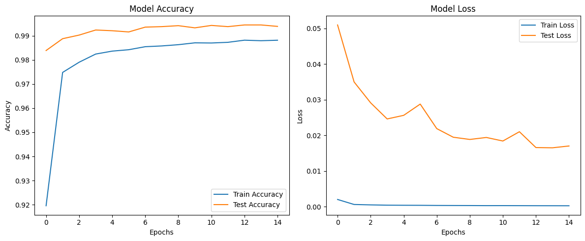

# Target: Reduce Parameter / Achieve 99.4% Acc/ less than 15 epochs 


Go to main Read me : [Link Text](README.md)

# Model Architecture

The Structure of model Looks Better and good. We are hitting targeted accuracy.

The parameter needs to be reduced.

How ?

1> **Remove Bias** . As we have added Batch norm , Bias is not needed here. We will never face Vanishing gradient because on BN.

2> **1x1 Kernel :** After pooling layer Use 1x1 kernel to reduce the channel size . 

3> **Channel:** reduce over all channel size.


```python
----------------------------------------------------------------
        Layer (type)               Output Shape         Param #
================================================================
            Conv2d-1            [-1, 8, 26, 26]              80
       BatchNorm2d-2            [-1, 8, 26, 26]              16
              ReLU-3            [-1, 8, 26, 26]               0
           Dropout-4            [-1, 8, 26, 26]               0
            Conv2d-5           [-1, 12, 24, 24]             876
       BatchNorm2d-6           [-1, 12, 24, 24]              24
              ReLU-7           [-1, 12, 24, 24]               0
           Dropout-8           [-1, 12, 24, 24]               0
            Conv2d-9           [-1, 16, 22, 22]           1,744
      BatchNorm2d-10           [-1, 16, 22, 22]              32
             ReLU-11           [-1, 16, 22, 22]               0
          Dropout-12           [-1, 16, 22, 22]               0
        MaxPool2d-13           [-1, 16, 11, 11]               0
           Conv2d-14            [-1, 8, 11, 11]             136
      BatchNorm2d-15            [-1, 8, 11, 11]              16
             ReLU-16            [-1, 8, 11, 11]               0
          Dropout-17            [-1, 8, 11, 11]               0
           Conv2d-18             [-1, 12, 9, 9]             876
      BatchNorm2d-19             [-1, 12, 9, 9]              24
             ReLU-20             [-1, 12, 9, 9]               0
          Dropout-21             [-1, 12, 9, 9]               0
           Conv2d-22             [-1, 16, 7, 7]           1,744
      BatchNorm2d-23             [-1, 16, 7, 7]              32
             ReLU-24             [-1, 16, 7, 7]               0
          Dropout-25             [-1, 16, 7, 7]               0
           Conv2d-26             [-1, 20, 5, 5]           2,900
      BatchNorm2d-27             [-1, 20, 5, 5]              40
             ReLU-28             [-1, 20, 5, 5]               0
          Dropout-29             [-1, 20, 5, 5]               0
           Conv2d-30             [-1, 20, 3, 3]           3,620
      BatchNorm2d-31             [-1, 20, 3, 3]              40
             ReLU-32             [-1, 20, 3, 3]               0
          Dropout-33             [-1, 20, 3, 3]               0
           Conv2d-34             [-1, 10, 1, 1]           1,810
================================================================
Total params: 14,010
Trainable params: 14,010
Non-trainable params: 0
----------------------------------------------------------------
Input size (MB): 0.00
Forward/backward pass size (MB): 0.73
Params size (MB): 0.05
Estimated Total Size (MB): 0.79
```

```python
=======================================Reciptive Field Calculator========================================
|    | Kernel_size   | Padding   |   Stride | Input_Img_size   | Output_Img_size   | Receptive_field   |
|---:|:--------------|:----------|---------:|:-----------------|:------------------|:------------------|
|  0 | 3*3           | NO        |        1 | 28*28            | 26*26             | 3*3               |
|  1 | 3*3           | NO        |        1 | 26*26            | 24*24             | 5*5               |
|  2 | 3*3           | NO        |        1 | 24*24            | 22*22             | 7*7               |
|  3 | 2*2           | NO        |        2 | 22*22            | 11*11             | 8*8               |
|  4 | 1*1           | NO        |        1 | 11*11            | 11*11             | 8*8               |
|  5 | 3*3           | NO        |        1 | 11*11            | 9*9               | 12*12             |
|  6 | 3*3           | NO        |        1 | 9*9              | 7*7               | 16*16             |
|  7 | 3*3           | NO        |        1 | 7*7              | 5*5               | 20*20             |
|  8 | 3*3           | NO        |        1 | 5*5              | 3*3               | 24*24             |
|  9 | 3*3           | NO        |        1 | 3*3              | 1*1               | 28*28             |
=========================================================================================================
```


# Training Model

```python
Train ==> Epochs: 0 Batch:  468 loss: 0.07711341232061386 Accuracy: 91.95% : 100%|█████████████████████████| 469/469 [00:04<00:00, 106.47it/s]
Test ==> Epochs: 0 Batch:  78 loss: 0.050951148722320795 Accuracy: 98.39% : 100%|████████████████████████████| 79/79 [00:00<00:00, 198.76it/s]
Insufficient test accuracy data.
LR: 0.015
Train ==> Epochs: 1 Batch:  468 loss: 0.12686587870121002 Accuracy: 97.48% : 100%|█████████████████████████| 469/469 [00:04<00:00, 114.40it/s]
Test ==> Epochs: 1 Batch:  78 loss: 0.03496963566541672 Accuracy: 98.88% : 100%|█████████████████████████████| 79/79 [00:00<00:00, 196.36it/s]
Conditions not met for saving the model.
LR: 0.015
Train ==> Epochs: 2 Batch:  468 loss: 0.03190337494015694 Accuracy: 97.91% : 100%|█████████████████████████| 469/469 [00:04<00:00, 112.60it/s]
Test ==> Epochs: 2 Batch:  78 loss: 0.029130875845393166 Accuracy: 99.03% : 100%|████████████████████████████| 79/79 [00:00<00:00, 197.20it/s]
Conditions not met for saving the model.
LR: 0.015
Train ==> Epochs: 3 Batch:  468 loss: 0.07558349519968033 Accuracy: 98.24% : 100%|█████████████████████████| 469/469 [00:04<00:00, 111.40it/s]
Test ==> Epochs: 3 Batch:  78 loss: 0.024610549466125668 Accuracy: 99.24% : 100%|████████████████████████████| 79/79 [00:00<00:00, 190.00it/s]
Conditions not met for saving the model.
LR: 0.015
Train ==> Epochs: 4 Batch:  468 loss: 0.0737043246626854 Accuracy: 98.37% : 100%|██████████████████████████| 469/469 [00:04<00:00, 113.96it/s]
Test ==> Epochs: 4 Batch:  78 loss: 0.025617954595014453 Accuracy: 99.21% : 100%|████████████████████████████| 79/79 [00:00<00:00, 196.16it/s]
Conditions not met for saving the model.
LR: 0.015
Train ==> Epochs: 5 Batch:  468 loss: 0.018471870571374893 Accuracy: 98.42% : 100%|████████████████████████| 469/469 [00:04<00:00, 110.87it/s]
Test ==> Epochs: 5 Batch:  78 loss: 0.028772923059016468 Accuracy: 99.16% : 100%|████████████████████████████| 79/79 [00:00<00:00, 196.60it/s]
Conditions not met for saving the model.
LR: 0.015
Train ==> Epochs: 6 Batch:  468 loss: 0.03431619703769684 Accuracy: 98.55% : 100%|█████████████████████████| 469/469 [00:04<00:00, 109.21it/s]
Test ==> Epochs: 6 Batch:  78 loss: 0.02190010171942413 Accuracy: 99.36% : 100%|█████████████████████████████| 79/79 [00:00<00:00, 195.77it/s]
Target Achieved: 99.36% Test Accuracy!!
LR: 0.015
Train ==> Epochs: 7 Batch:  468 loss: 0.05356372892856598 Accuracy: 98.58% : 100%|█████████████████████████| 469/469 [00:04<00:00, 109.57it/s]
Test ==> Epochs: 7 Batch:  78 loss: 0.019484007251821457 Accuracy: 99.38% : 100%|████████████████████████████| 79/79 [00:00<00:00, 197.65it/s]
Target Achieved: 99.38% Test Accuracy!!
LR: 0.015
Train ==> Epochs: 8 Batch:  468 loss: 0.013253743760287762 Accuracy: 98.63% : 100%|████████████████████████| 469/469 [00:04<00:00, 113.05it/s]
Test ==> Epochs: 8 Batch:  78 loss: 0.018864402094855903 Accuracy: 99.42% : 100%|████████████████████████████| 79/79 [00:00<00:00, 184.31it/s]
Target Achieved: 99.42% Test Accuracy!!
LR: 0.015
Train ==> Epochs: 9 Batch:  468 loss: 0.003144158748909831 Accuracy: 98.71% : 100%|████████████████████████| 469/469 [00:04<00:00, 106.23it/s]
Test ==> Epochs: 9 Batch:  78 loss: 0.01941835846249014 Accuracy: 99.33% : 100%|█████████████████████████████| 79/79 [00:00<00:00, 193.08it/s]
Conditions not met for saving the model.
LR: 0.015
Train ==> Epochs: 10 Batch:  468 loss: 0.01635020785033703 Accuracy: 98.70% : 100%|████████████████████████| 469/469 [00:04<00:00, 109.42it/s]
Test ==> Epochs: 10 Batch:  78 loss: 0.01842596851401031 Accuracy: 99.43% : 100%|████████████████████████████| 79/79 [00:00<00:00, 183.73it/s]
Target Achieved: 99.43% Test Accuracy!!
LR: 0.015
Train ==> Epochs: 11 Batch:  468 loss: 0.007858705706894398 Accuracy: 98.73% : 100%|███████████████████████| 469/469 [00:04<00:00, 111.06it/s]
Test ==> Epochs: 11 Batch:  78 loss: 0.021025117903202772 Accuracy: 99.38% : 100%|███████████████████████████| 79/79 [00:00<00:00, 202.19it/s]
Conditions not met for saving the model.
LR: 0.015
Train ==> Epochs: 12 Batch:  468 loss: 0.12171391397714615 Accuracy: 98.82% : 100%|████████████████████████| 469/469 [00:04<00:00, 111.08it/s]
Test ==> Epochs: 12 Batch:  78 loss: 0.016588981576450168 Accuracy: 99.45% : 100%|███████████████████████████| 79/79 [00:00<00:00, 200.70it/s]
Target Achieved: 99.45% Test Accuracy!!
LR: 0.015
Train ==> Epochs: 13 Batch:  468 loss: 0.06750056892633438 Accuracy: 98.80% : 100%|████████████████████████| 469/469 [00:04<00:00, 108.40it/s]
Test ==> Epochs: 13 Batch:  78 loss: 0.016523083271458745 Accuracy: 99.45% : 100%|███████████████████████████| 79/79 [00:00<00:00, 193.65it/s]
Conditions not met for saving the model.
LR: 0.015
Train ==> Epochs: 14 Batch:  468 loss: 0.09231066703796387 Accuracy: 98.82% : 100%|████████████████████████| 469/469 [00:04<00:00, 114.29it/s]
Test ==> Epochs: 14 Batch:  78 loss: 0.017030247780680657 Accuracy: 99.39% : 100%|███████████████████████████| 79/79 [00:00<00:00, 198.01it/s]
Conditions not met for saving the model.
LR: 0.015
```

```python
Max Train Accuracy:  0.9881833333333333
Max Test Accuracy:  0.9945
```



# Observations

The model Hit the Required Accuracy in 8th epoch and continued pushing boundaries. 

The model Seems to be slight  Under fit, But it is because we have added The Dropout layer 

But The parameters used in the model are still huge  (Total Params: 14,010). That is not good . 

WE need less than 8k .


## What Next ?

Lets try putting some Garam Masala now   .. 
