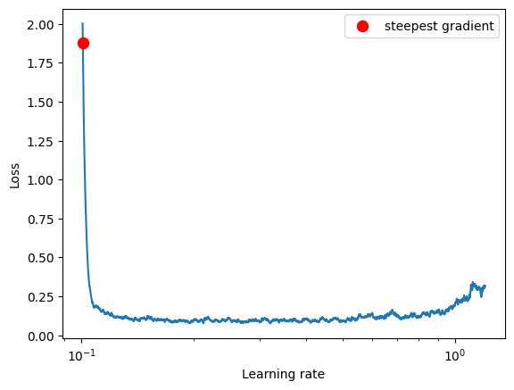
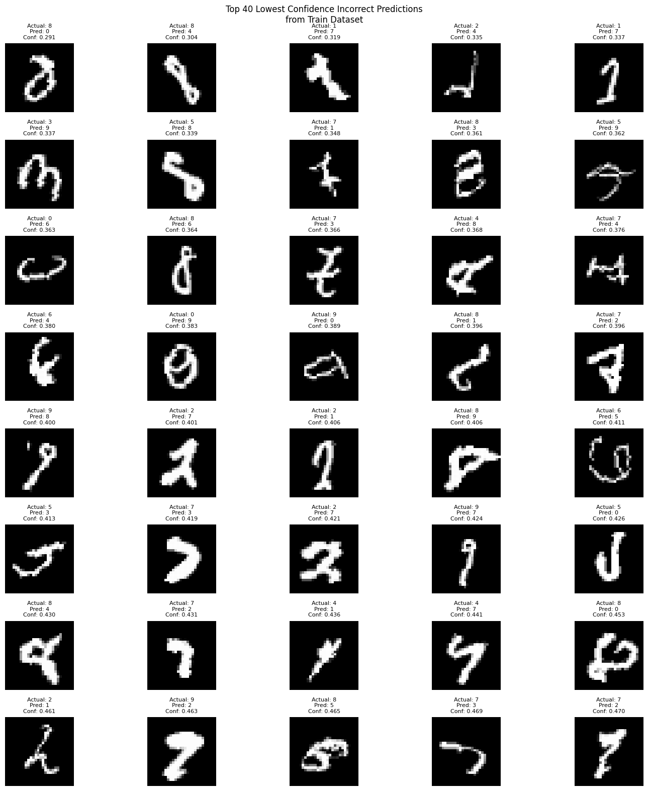
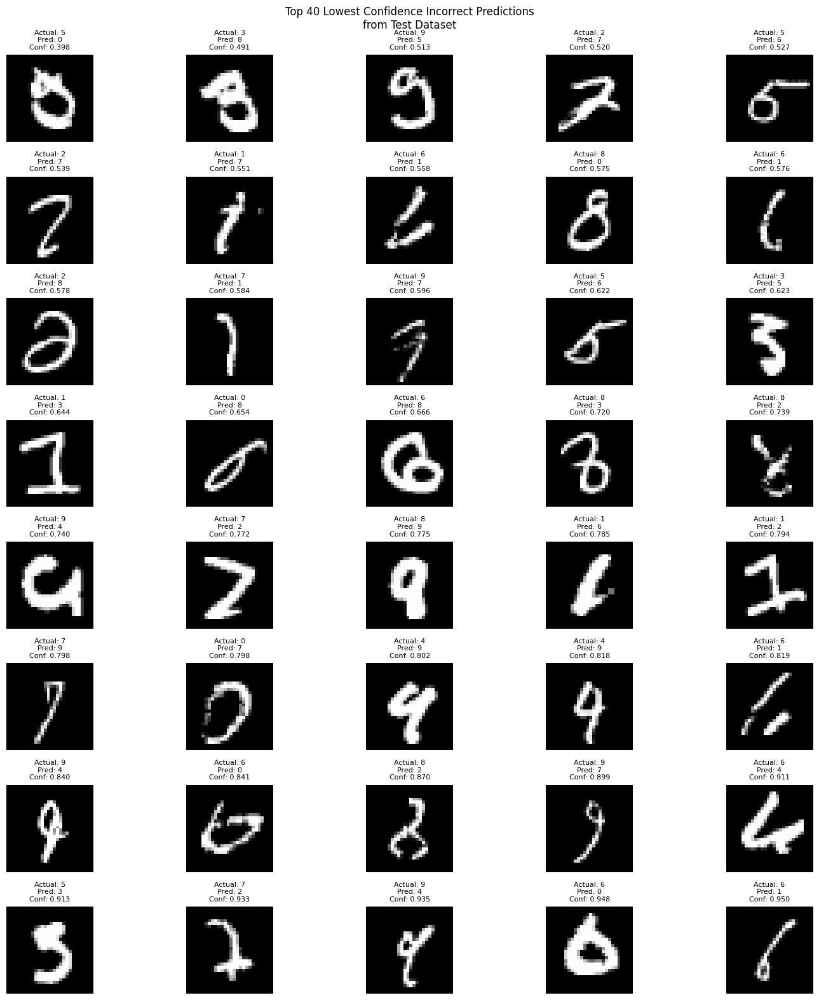

# Target: Reduce parameter to less than 8k


Go to main Read me : [Link Text](https://github.com/Code-Trees/Evolution_of_AI/blob/main/Best_way_model_building/README.md)


# The model:


```python
----------------------------------------------------------------
        Layer (type)               Output Shape         Param #
================================================================
            Conv2d-1           [-1, 10, 26, 26]              90
       BatchNorm2d-2           [-1, 10, 26, 26]              20
              ReLU-3           [-1, 10, 26, 26]               0
           Dropout-4           [-1, 10, 26, 26]               0
            Conv2d-5           [-1, 10, 24, 24]             900
       BatchNorm2d-6           [-1, 10, 24, 24]              20
              ReLU-7           [-1, 10, 24, 24]               0
           Dropout-8           [-1, 10, 24, 24]               0
            Conv2d-9           [-1, 15, 22, 22]           1,350
      BatchNorm2d-10           [-1, 15, 22, 22]              30
             ReLU-11           [-1, 15, 22, 22]               0
          Dropout-12           [-1, 15, 22, 22]               0
        MaxPool2d-13           [-1, 15, 11, 11]               0
           Conv2d-14           [-1, 10, 11, 11]             150
      BatchNorm2d-15           [-1, 10, 11, 11]              20
             ReLU-16           [-1, 10, 11, 11]               0
          Dropout-17           [-1, 10, 11, 11]               0
           Conv2d-18             [-1, 10, 9, 9]             900
      BatchNorm2d-19             [-1, 10, 9, 9]              20
             ReLU-20             [-1, 10, 9, 9]               0
          Dropout-21             [-1, 10, 9, 9]               0
           Conv2d-22             [-1, 10, 7, 7]             900
      BatchNorm2d-23             [-1, 10, 7, 7]              20
             ReLU-24             [-1, 10, 7, 7]               0
          Dropout-25             [-1, 10, 7, 7]               0
           Conv2d-26             [-1, 10, 5, 5]             900
      BatchNorm2d-27             [-1, 10, 5, 5]              20
             ReLU-28             [-1, 10, 5, 5]               0
          Dropout-29             [-1, 10, 5, 5]               0
           Conv2d-30             [-1, 10, 1, 1]           2,500
================================================================
Total params: 7,840
Trainable params: 7,840
Non-trainable params: 0
----------------------------------------------------------------
Input size (MB): 0.00
Forward/backward pass size (MB): 0.70
Params size (MB): 0.03
Estimated Total Size (MB): 0.73
----------------------------------------------------------------
```

```python
=======================================Reciptive Field Calculator========================================
|    | Kernel_size   | Padding   |   Stride | Input_Img_size   | Output_Img_size   | Receptive_field   |
|---:|:--------------|:----------|---------:|:-----------------|:------------------|:------------------|
|  0 | 3*3           | NO        |        1 | 28*28            | 26*26             | 3*3               |
|  1 | 3*3           | NO        |        1 | 26*26            | 24*24             | 5*5               |
|  2 | 3*3           | NO        |        1 | 24*24            | 22*22             | 7*7               |
|  3 | 2*2           | NO        |        2 | 22*22            | 11*11             | 8*8               |
|  4 | 1*1           | NO        |        1 | 11*11            | 11*11             | 8*8               |
|  5 | 3*3           | NO        |        1 | 11*11            | 9*9               | 12*12             |
|  6 | 3*3           | NO        |        1 | 9*9              | 7*7               | 16*16             |
|  7 | 3*3           | NO        |        1 | 7*7              | 5*5               | 20*20             |
|  8 | 5*5           | NO        |        1 | 5*5              | 1*1               | 28*28             |
=========================================================================================================
```

```python
Train ==> Epochs: 0 Batch:  468 loss: 0.09212353080511093 Accuracy: 92.77% : 100%|█████████████████████████████████████████████████████████████████████████| 469/469 [00:04<00:00, 111.87it/s]
Test ==> Epochs: 0 Batch:  78 loss: 0.05814522932767868 Accuracy: 98.22% : 100%|█████████████████████████████████████████████████████████████████████████████| 79/79 [00:00<00:00, 182.62it/s]
Insufficient test accuracy data.
LR: 0.10080224034423935
Train ==> Epochs: 1 Batch:  468 loss: 0.11005734652280807 Accuracy: 96.95% : 100%|█████████████████████████████████████████████████████████████████████████| 469/469 [00:04<00:00, 110.61it/s]
Test ==> Epochs: 1 Batch:  78 loss: 0.04768860439956188 Accuracy: 98.58% : 100%|█████████████████████████████████████████████████████████████████████████████| 79/79 [00:00<00:00, 196.15it/s]
Conditions not met for saving the model.
LR: 0.10080224034423935
Train ==> Epochs: 2 Batch:  468 loss: 0.07364116609096527 Accuracy: 97.26% : 100%|█████████████████████████████████████████████████████████████████████████| 469/469 [00:04<00:00, 109.20it/s]
Test ==> Epochs: 2 Batch:  78 loss: 0.03464922721385956 Accuracy: 98.89% : 100%|█████████████████████████████████████████████████████████████████████████████| 79/79 [00:00<00:00, 187.17it/s]
Conditions not met for saving the model.
LR: 0.10080224034423935
Train ==> Epochs: 3 Batch:  468 loss: 0.007149364799261093 Accuracy: 97.59% : 100%|████████████████████████████████████████████████████████████████████████| 469/469 [00:04<00:00, 108.47it/s]
Test ==> Epochs: 3 Batch:  78 loss: 0.030723155471868813 Accuracy: 98.97% : 100%|████████████████████████████████████████████████████████████████████████████| 79/79 [00:00<00:00, 185.69it/s]
Conditions not met for saving the model.
LR: 0.10080224034423935
Train ==> Epochs: 4 Batch:  468 loss: 0.08439592272043228 Accuracy: 97.78% : 100%|█████████████████████████████████████████████████████████████████████████| 469/469 [00:04<00:00, 109.07it/s]
Test ==> Epochs: 4 Batch:  78 loss: 0.03019285760708153 Accuracy: 98.95% : 100%|█████████████████████████████████████████████████████████████████████████████| 79/79 [00:00<00:00, 171.26it/s]
Conditions not met for saving the model.
LR: 0.10080224034423935
Train ==> Epochs: 5 Batch:  468 loss: 0.046797674149274826 Accuracy: 97.84% : 100%|████████████████████████████████████████████████████████████████████████| 469/469 [00:04<00:00, 110.89it/s]
Test ==> Epochs: 5 Batch:  78 loss: 0.024491356252133847 Accuracy: 99.18% : 100%|████████████████████████████████████████████████████████████████████████████| 79/79 [00:00<00:00, 188.11it/s]
Conditions not met for saving the model.
LR: 0.10080224034423935
Train ==> Epochs: 6 Batch:  468 loss: 0.015085098333656788 Accuracy: 97.96% : 100%|████████████████████████████████████████████████████████████████████████| 469/469 [00:04<00:00, 110.69it/s]
Test ==> Epochs: 6 Batch:  78 loss: 0.0314102898158133 Accuracy: 98.96% : 100%|██████████████████████████████████████████████████████████████████████████████| 79/79 [00:00<00:00, 179.05it/s]
Conditions not met for saving the model.
LR: 0.10080224034423935
Train ==> Epochs: 7 Batch:  468 loss: 0.2118207961320877 Accuracy: 98.06% : 100%|██████████████████████████████████████████████████████████████████████████| 469/469 [00:04<00:00, 109.24it/s]
Test ==> Epochs: 7 Batch:  78 loss: 0.025353129401803016 Accuracy: 99.20% : 100%|████████████████████████████████████████████████████████████████████████████| 79/79 [00:00<00:00, 174.53it/s]
Conditions not met for saving the model.
LR: 0.10080224034423935
Train ==> Epochs: 8 Batch:  468 loss: 0.02431732416152954 Accuracy: 98.02% : 100%|█████████████████████████████████████████████████████████████████████████| 469/469 [00:04<00:00, 109.18it/s]
Test ==> Epochs: 8 Batch:  78 loss: 0.025130902411043644 Accuracy: 99.25% : 100%|████████████████████████████████████████████████████████████████████████████| 79/79 [00:00<00:00, 195.03it/s]
Conditions not met for saving the model.
LR: 0.010080224034423935
Train ==> Epochs: 9 Batch:  468 loss: 0.01332076545804739 Accuracy: 98.44% : 100%|█████████████████████████████████████████████████████████████████████████| 469/469 [00:04<00:00, 108.46it/s]
Test ==> Epochs: 9 Batch:  78 loss: 0.02061711220755242 Accuracy: 99.36% : 100%|█████████████████████████████████████████████████████████████████████████████| 79/79 [00:00<00:00, 185.94it/s]
Target Achieved: 99.36% Test Accuracy!!
LR: 0.010080224034423935
Train ==> Epochs: 10 Batch:  468 loss: 0.015133660286664963 Accuracy: 98.52% : 100%|███████████████████████████████████████████████████████████████████████| 469/469 [00:04<00:00, 110.33it/s]
Test ==> Epochs: 10 Batch:  78 loss: 0.02010468928143382 Accuracy: 99.39% : 100%|████████████████████████████████████████████████████████████████████████████| 79/79 [00:00<00:00, 179.79it/s]
Target Achieved: 99.39% Test Accuracy!!
LR: 0.010080224034423935
Train ==> Epochs: 11 Batch:  468 loss: 0.05695578455924988 Accuracy: 98.66% : 100%|████████████████████████████████████████████████████████████████████████| 469/469 [00:04<00:00, 107.37it/s]
Test ==> Epochs: 11 Batch:  78 loss: 0.0187287402221933 Accuracy: 99.48% : 100%|█████████████████████████████████████████████████████████████████████████████| 79/79 [00:00<00:00, 176.32it/s]
Target Achieved: 99.48% Test Accuracy!!
LR: 0.010080224034423935
Train ==> Epochs: 12 Batch:  468 loss: 0.07540423423051834 Accuracy: 98.56% : 100%|████████████████████████████████████████████████████████████████████████| 469/469 [00:04<00:00, 104.31it/s]
Test ==> Epochs: 12 Batch:  78 loss: 0.018561058009415866 Accuracy: 99.43% : 100%|███████████████████████████████████████████████████████████████████████████| 79/79 [00:00<00:00, 180.08it/s]
Conditions not met for saving the model.
LR: 0.010080224034423935
Train ==> Epochs: 13 Batch:  468 loss: 0.04020127281546593 Accuracy: 98.61% : 100%|████████████████████████████████████████████████████████████████████████| 469/469 [00:04<00:00, 106.60it/s]
Test ==> Epochs: 13 Batch:  78 loss: 0.019587678169459104 Accuracy: 99.41% : 100%|███████████████████████████████████████████████████████████████████████████| 79/79 [00:00<00:00, 180.39it/s]
Conditions not met for saving the model.
LR: 0.010080224034423935
Train ==> Epochs: 14 Batch:  468 loss: 0.022925393655896187 Accuracy: 98.56% : 100%|███████████████████████████████████████████████████████████████████████| 469/469 [00:04<00:00, 107.54it/s]
Test ==> Epochs: 14 Batch:  78 loss: 0.018888854747172446 Accuracy: 99.38% : 100%|███████████████████████████████████████████████████████████████████████████| 79/79 [00:00<00:00, 176.43it/s]
Conditions not met for saving the model.
LR: 0.0010080224034423936
```


After reducing the Parameter we are still able to hit the accuracy but with LR Finder .


# What is LR Finder 

**LR (Learning Rate) Finder** is a method used to determine an optimal learning rate for training deep learning models. It is particularly helpful in finding a learning rate that can speed up training and improve convergence. The idea was popularized by Leslie N. Smith in his work on Cyclical Learning Rates.

### How LR Finder Works:

1. **Gradual Increase of Learning Rate:**

   - Start training the model with a very low learning rate.
   - Gradually increase the learning rate exponentially over several iterations or epochs.

2. **Track the Loss:**

   - Monitor the training loss during this process.
   - As the learning rate increases, the model initially improves, but at some point, the loss will stop decreasing or start increasing due to instability.

3. **Plot Loss vs. Learning Rate:**

   - Plot the training loss against the learning rate.
   - Look for the range where the loss decreases steadily before it starts to diverge.

4. **Select Optimal Learning Rate:**

   - Choose a learning rate in the region where the loss decreases sharply, but before it starts increasing.

     

   - ```python
      83%|███████████████████████████████████████████████████████████████████████████████████████████████████████████████████████████                         | 3741/4500 [00:32<00:06, 113.55it/s]
     Stopping early, the loss has diverged
     Learning rate search finished. See the graph with {finder_name}.plot()
     LR suggestion: steepest gradient
     Suggested LR: 1.01E-01
     ```



```python 
Loss: 0.07616443393017538 LR: 0.10080224034423935
[0.10080224034423935]
```

 

With The LR, we Can use ReduleLRonPlateau  and adjust parameters when ever our loss is in plateau.

```json
{
    "seed":5,
    "best_model":0.993,
    "training": {
        "batch_size": 128,
        "epochs": 15,
        "start_lr": [1e-1],
        "end_lr": [2],
        "loss_type": "nll",
        "use_scheduler":1 ,
        "runlr_finer":1,
        "scheduler_type": "reducelronplateau",
        "lr_iter": 4500
    }
}
```

with The change 

# Observation 


The model is Good and Achieved The Accuracy 

But now i want to push the limit to see the Upto where i can reduce it.


# What is going wrong in training and testing 

```
2024-12-11 22:50:36,886 - INFO - Loading configuration...
2024-12-11 22:50:36,887 - INFO - Using device: cuda
2024-12-11 22:50:36,897 - INFO - Loading model: modelbest_0.9948_epoch_11.pt
2024-12-11 22:50:36,906 - INFO - Model loaded successfully.
2024-12-11 22:50:46,002 - INFO - Starting validation on train dataset...
Validating train: 100%|██████████████████████████████████████████████████████████████████████████████████████████████████████████████████████████████████| 469/469 [00:14<00:00, 31.66batch/s]
2024-12-11 22:51:00,817 - INFO - Number of incorrect predictions in train dataset: 704
2024-12-11 22:51:00,818 - INFO - Starting validation on test dataset...
Validating test: 100%|█████████████████████████████████████████████████████████████████████████████████████████████████████████████████████████████████████| 79/79 [00:01<00:00, 74.12batch/s]
2024-12-11 22:51:01,885 - INFO - Number of incorrect predictions in test dataset: 52
```



OOOOOOO. Whats wrong with data . Some i cant read . But some are really not able to detect  Training goes wrong here 

In test .




# **<u>This gives me IDEA to increase receptive field beyond 28  to predict these images . In that way  model can  look at a Zoom out view of some and should  predict  well.</u>**

**<u>But how ?</u>**

1> **Increase the Layers by adding padding .**  *<u>But that will increase parameters</u>* 

2> **Increase the receptive field by adding Higher kernel.** *<u>But that will increase parameters</u>* 

3> **Use 1x1 Very often .** *<u>But that will reduce learn able parameters and hence it might under-fit</u>*  

4> **Add more Image.** *<u>But what kind of augmentation i can add. May be more angle or rotation /</u>*

5> **Use Dilatation**. <u>*Hmmm. That might work*</u> 

