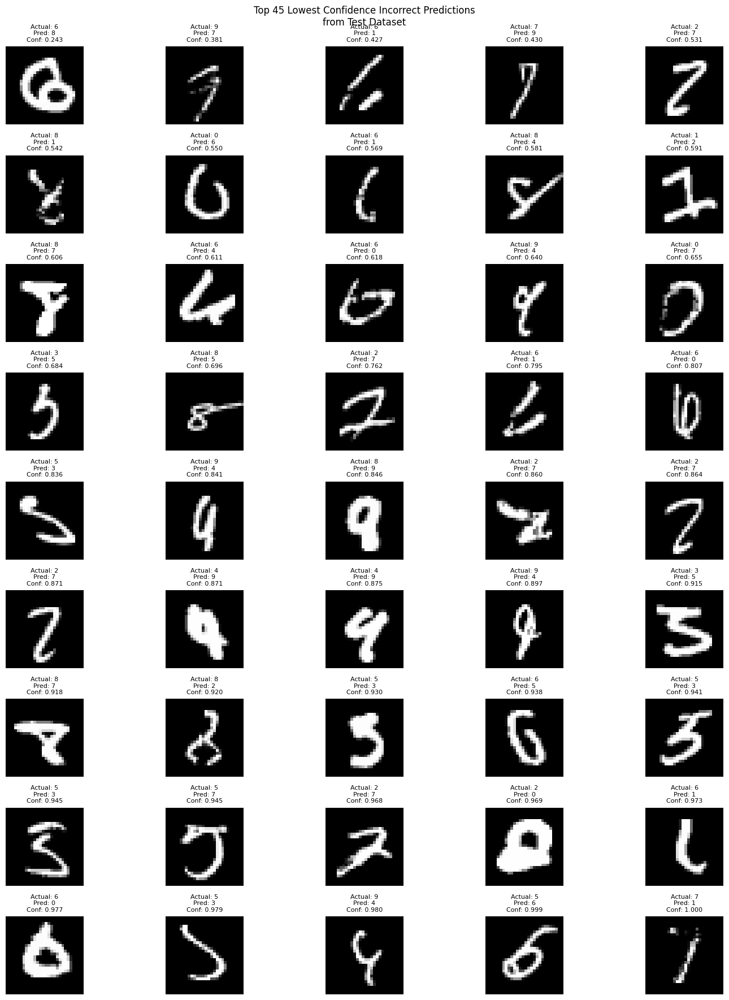
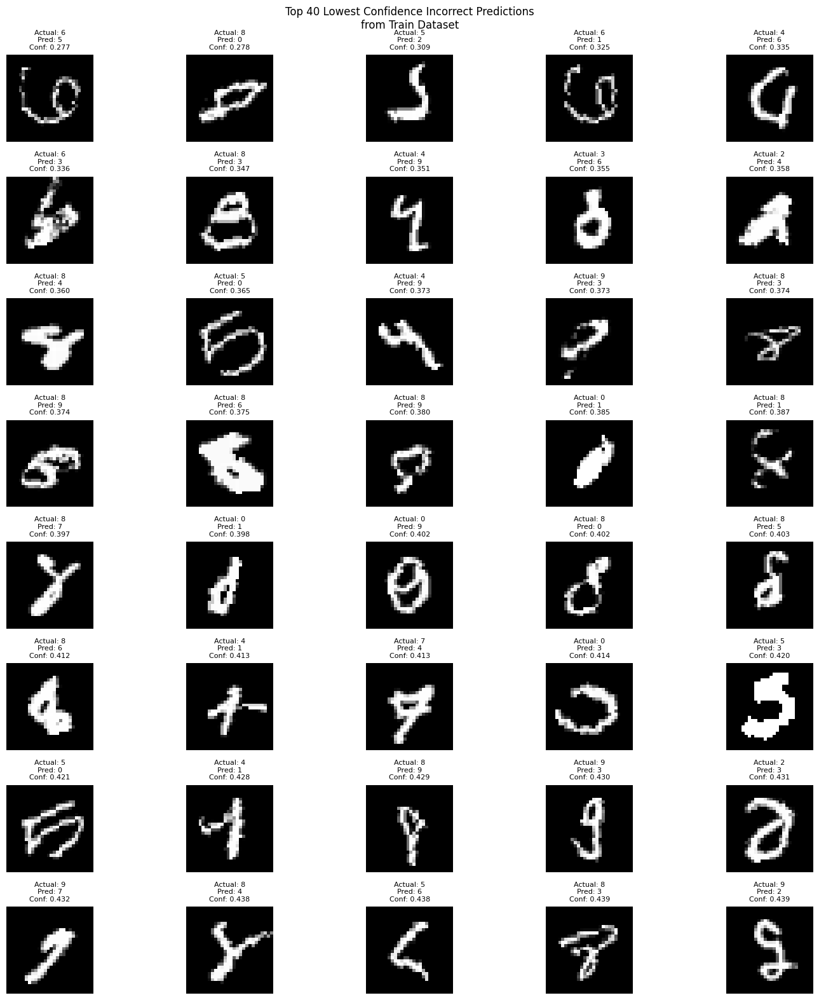

# Target: Achieved 99.55% accuracy  in 5,340 parameters in 12th iteration


Go to main Read me : [Link Text](https://github.com/Code-Trees/Evolution_of_AI/blob/main/Best_way_model_building/README.md)

```python
----------------------------------------------------------------
        Layer (type)               Output Shape         Param #
================================================================
            Conv2d-1           [-1, 10, 26, 26]              90
       BatchNorm2d-2           [-1, 10, 26, 26]              20
              ReLU-3           [-1, 10, 26, 26]               0
           Dropout-4           [-1, 10, 26, 26]               0
            Conv2d-5           [-1, 10, 24, 24]             900
       BatchNorm2d-6           [-1, 10, 24, 24]              20
              ReLU-7           [-1, 10, 24, 24]               0
           Dropout-8           [-1, 10, 24, 24]               0
            Conv2d-9           [-1, 15, 22, 22]           1,350
      BatchNorm2d-10           [-1, 15, 22, 22]              30
             ReLU-11           [-1, 15, 22, 22]               0
          Dropout-12           [-1, 15, 22, 22]               0
        MaxPool2d-13           [-1, 15, 11, 11]               0
           Conv2d-14           [-1, 10, 11, 11]             150
      BatchNorm2d-15           [-1, 10, 11, 11]              20
             ReLU-16           [-1, 10, 11, 11]               0
          Dropout-17           [-1, 10, 11, 11]               0
           Conv2d-18             [-1, 10, 9, 9]             900
      BatchNorm2d-19             [-1, 10, 9, 9]              20
             ReLU-20             [-1, 10, 9, 9]               0
          Dropout-21             [-1, 10, 9, 9]               0
           Conv2d-22             [-1, 10, 7, 7]             900
      BatchNorm2d-23             [-1, 10, 7, 7]              20
             ReLU-24             [-1, 10, 7, 7]               0
          Dropout-25             [-1, 10, 7, 7]               0
           Conv2d-26             [-1, 10, 5, 5]             900
      BatchNorm2d-27             [-1, 10, 5, 5]              20
             ReLU-28             [-1, 10, 5, 5]               0
          Dropout-29             [-1, 10, 5, 5]               0
AdaptiveAvgPool2d-30             [-1, 10, 1, 1]               0
================================================================
Total params: 5,340
Trainable params: 5,340
Non-trainable params: 0
----------------------------------------------------------------
Input size (MB): 0.00
Forward/backward pass size (MB): 0.70
Params size (MB): 0.02
Estimated Total Size (MB): 0.73
----------------------------------------------------------------
```

```python
Train ==> Epochs: 0 Batch:  468 loss: 0.08429612964391708 Accuracy: 93.73% : 100%|██████████████████████████| 469/469 [00:10<00:00, 43.06it/s]
Test ==> Epochs: 0 Batch:  78 loss: 0.04751643937379122 Accuracy: 98.44% : 100%|█████████████████████████████| 79/79 [00:00<00:00, 139.67it/s]
Insufficient test accuracy data.
LR: 0.10470379786343671
Train ==> Epochs: 1 Batch:  468 loss: 0.07999590039253235 Accuracy: 97.16% : 100%|██████████████████████████| 469/469 [00:11<00:00, 41.78it/s]
Test ==> Epochs: 1 Batch:  78 loss: 0.04003035141229629 Accuracy: 98.68% : 100%|█████████████████████████████| 79/79 [00:00<00:00, 140.92it/s]
Conditions not met for saving the model.
LR: 0.10470379786343671
Train ==> Epochs: 2 Batch:  468 loss: 0.06669685989618301 Accuracy: 97.56% : 100%|██████████████████████████| 469/469 [00:11<00:00, 41.87it/s]
Test ==> Epochs: 2 Batch:  78 loss: 0.038444595198333265 Accuracy: 98.84% : 100%|████████████████████████████| 79/79 [00:00<00:00, 141.99it/s]
Conditions not met for saving the model.
LR: 0.10470379786343671
Train ==> Epochs: 3 Batch:  468 loss: 0.05630810558795929 Accuracy: 97.83% : 100%|██████████████████████████| 469/469 [00:11<00:00, 41.81it/s]
Test ==> Epochs: 3 Batch:  78 loss: 0.027877245303243398 Accuracy: 99.13% : 100%|████████████████████████████| 79/79 [00:00<00:00, 135.12it/s]
Conditions not met for saving the model.
LR: 0.10470379786343671
Train ==> Epochs: 4 Batch:  468 loss: 0.06767883896827698 Accuracy: 97.93% : 100%|██████████████████████████| 469/469 [00:11<00:00, 41.73it/s]
Test ==> Epochs: 4 Batch:  78 loss: 0.02411178403198719 Accuracy: 99.30% : 100%|█████████████████████████████| 79/79 [00:00<00:00, 144.21it/s]
Target Achieved: 99.30% Test Accuracy!!
LR: 0.10470379786343671
Train ==> Epochs: 5 Batch:  468 loss: 0.03669905662536621 Accuracy: 98.07% : 100%|██████████████████████████| 469/469 [00:11<00:00, 41.66it/s]
Test ==> Epochs: 5 Batch:  78 loss: 0.02256702058017254 Accuracy: 99.34% : 100%|█████████████████████████████| 79/79 [00:00<00:00, 147.14it/s]
Target Achieved: 99.34% Test Accuracy!!
LR: 0.10470379786343671
Train ==> Epochs: 6 Batch:  468 loss: 0.08133464306592941 Accuracy: 98.09% : 100%|██████████████████████████| 469/469 [00:11<00:00, 41.29it/s]
Test ==> Epochs: 6 Batch:  78 loss: 0.02199115399904549 Accuracy: 99.32% : 100%|█████████████████████████████| 79/79 [00:00<00:00, 141.89it/s]
Conditions not met for saving the model.
LR: 0.10470379786343671
Train ==> Epochs: 7 Batch:  468 loss: 0.07088207453489304 Accuracy: 98.23% : 100%|██████████████████████████| 469/469 [00:09<00:00, 47.08it/s]
Test ==> Epochs: 7 Batch:  78 loss: 0.022306216959655286 Accuracy: 99.29% : 100%|████████████████████████████| 79/79 [00:00<00:00, 143.57it/s]
Conditions not met for saving the model.
LR: 0.10470379786343671
Train ==> Epochs: 8 Batch:  468 loss: 0.04231416806578636 Accuracy: 98.25% : 100%|██████████████████████████| 469/469 [00:11<00:00, 41.12it/s]
Test ==> Epochs: 8 Batch:  78 loss: 0.021874626899976282 Accuracy: 99.27% : 100%|████████████████████████████| 79/79 [00:00<00:00, 144.17it/s]
Conditions not met for saving the model.
LR: 0.010470379786343673
Train ==> Epochs: 9 Batch:  468 loss: 0.14019548892974854 Accuracy: 98.48% : 100%|██████████████████████████| 469/469 [00:11<00:00, 41.67it/s]
Test ==> Epochs: 9 Batch:  78 loss: 0.018106948681175707 Accuracy: 99.46% : 100%|████████████████████████████| 79/79 [00:00<00:00, 141.57it/s]
Target Achieved: 99.46% Test Accuracy!!
LR: 0.010470379786343673
Train ==> Epochs: 10 Batch:  468 loss: 0.017599599435925484 Accuracy: 98.57% : 100%|████████████████████████| 469/469 [00:11<00:00, 41.57it/s]
Test ==> Epochs: 10 Batch:  78 loss: 0.01723082539178431 Accuracy: 99.47% : 100%|████████████████████████████| 79/79 [00:00<00:00, 147.60it/s]
Target Achieved: 99.47% Test Accuracy!!
LR: 0.010470379786343673
Train ==> Epochs: 11 Batch:  468 loss: 0.01653793454170227 Accuracy: 98.59% : 100%|█████████████████████████| 469/469 [00:11<00:00, 41.91it/s]
Test ==> Epochs: 11 Batch:  78 loss: 0.016916205030865966 Accuracy: 99.53% : 100%|███████████████████████████| 79/79 [00:00<00:00, 133.54it/s]
Target Achieved: 99.53% Test Accuracy!!
LR: 0.010470379786343673
Train ==> Epochs: 12 Batch:  468 loss: 0.043063029646873474 Accuracy: 98.57% : 100%|████████████████████████| 469/469 [00:11<00:00, 40.89it/s]
Test ==> Epochs: 12 Batch:  78 loss: 0.018190599500015378 Accuracy: 99.55% : 100%|███████████████████████████| 79/79 [00:00<00:00, 143.95it/s]
Target Achieved: 99.55% Test Accuracy!!
LR: 0.010470379786343673
Train ==> Epochs: 13 Batch:  468 loss: 0.06336142867803574 Accuracy: 98.61% : 100%|█████████████████████████| 469/469 [00:11<00:00, 41.28it/s]
Test ==> Epochs: 13 Batch:  78 loss: 0.016056551749701612 Accuracy: 99.55% : 100%|███████████████████████████| 79/79 [00:00<00:00, 142.16it/s]
Conditions not met for saving the model.
LR: 0.010470379786343673
Train ==> Epochs: 14 Batch:  468 loss: 0.025118166580796242 Accuracy: 98.62% : 100%|████████████████████████| 469/469 [00:11<00:00, 41.65it/s]
Test ==> Epochs: 14 Batch:  78 loss: 0.017048460460454225 Accuracy: 99.55% : 100%|███████████████████████████| 79/79 [00:00<00:00, 147.96it/s]
Conditions not met for saving the model.
LR: 0.010470379786343673
```

```python
Max Train Accuracy:  0.98625
Max Test Accuracy:  0.9955
```

Dilation is a technique used in convolutional layers to expand the receptive field without increasing the number of parameters or performing pooling. It works by introducing spaces between kernel elements.

- **Dilation Rate:** Determines the spacing between kernel elements. A dilation rate of ddd means the kernel operates on every ddd-th pixel in both height and width.
- Advantages:
  - Larger receptive field without increasing kernel size or the number of layers.
  - Useful in tasks like semantic segmentation and where capturing context is important.
- **Formula for Output Size with Dilation:** Output Size=Input Size+2×Padding−Dilation×(Kernel Size−1)−1Stride+1\text{Output Size} = \frac{\text{Input Size} + 2 \times \text{Padding} - \text{Dilation} \times (\text{Kernel Size} - 1) - 1}{\text{Stride}} + 1Output Size=StrideInput Size+2×Padding−Dilation×(Kernel Size−1)−1+1


# Infrencing

```python
2024-12-12 22:32:43,622 - INFO - Loading configuration...
2024-12-12 22:32:43,628 - INFO - Using device: cuda
2024-12-12 22:32:43,725 - INFO - Loading model: modelbest_0.9955_epoch_12.pt
2024-12-12 22:32:43,734 - INFO - Model loaded successfully.
2024-12-12 22:32:52,800 - INFO - Starting validation on train dataset...
Validating train: 100%|██████████████████████████████████████████████████████████████████████████████████| 469/469 [00:16<00:00, 29.22batch/s]
2024-12-12 22:33:08,851 - INFO - Number of incorrect predictions in train dataset: 610
2024-12-12 22:33:08,852 - INFO - Starting validation on test dataset...
Validating test: 100%|█████████████████████████████████████████████████████████████████████████████████████| 79/79 [00:01<00:00, 67.42batch/s]
2024-12-12 22:33:10,025 - INFO - Number of incorrect predictions in test dataset: 45
```





# The model Architecture 

1> **Input Block:**

- Initial convolution layer with 10 filters, kernel size 3×33 \times 33×3, and no padding.
- ReLU activation, BatchNorm, and Dropout are used for regularization.

2> **Convolution Block 1:**

- Three sequential convolution layers increase the depth and complexity of features extracted.
- Final layer increases the channel count to 15.

3> **Transition Block 1:**

- MaxPooling reduces spatial dimensions to half, controlling the computation and overfitting.
- 1×11 \times 11×1 convolution reduces the channel count back to 10.

4> **Convolution Block 2 with Dilation:**

- Three dilated convolution layers extract features with a progressively increasing receptive field.
- Each layer maintains the same spatial dimensions using padding.

5> **GAP Layer:**

- Global Average Pooling (GAP) reduces spatial dimensions to 1×11 \times 11×1 while preserving the depth.

6> **Final Output:**

- The model outputs logits for 10 classes using F.log_softmaxF.log\_softmaxF.log_softmax.

```python
class Net(nn.Module):
def __init__(self):
    super(Net, self).__init__()
    self.dropout_value = 0.03
    # Input Block
    self.convblock1 = nn.Sequential(
          nn.Conv2d(in_channels=1, out_channels=10, kernel_size=(3, 3), padding=0, bias=False),
          nn.BatchNorm2d(10),
          nn.ReLU(),
          nn.Dropout(self.dropout_value)  
       ) 
    self.convblock2 = nn.Sequential(
        nn.Conv2d(in_channels=10, out_channels=10, kernel_size=(3, 3), padding=0, bias=False),
        nn.BatchNorm2d(10),
        nn.ReLU(),
        nn.Dropout(self.dropout_value)
    ) 
    self.convblock3 = nn.Sequential(
        nn.Conv2d(in_channels=10, out_channels=15, kernel_size=(3, 3), padding=0, bias=False),
        nn.BatchNorm2d(15),
        nn.ReLU(),
        nn.Dropout(self.dropout_value)
    ) 

    # TRANSITION BLOCK 1
    self.pool1 = nn.MaxPool2d(2, 2)
    
    self.convblock4 = nn.Sequential(
        nn.Conv2d(in_channels=15, out_channels=10, kernel_size=(1, 1), padding=0, bias=False),
        nn.BatchNorm2d(10),
        nn.ReLU(),
        nn.Dropout(self.dropout_value)
    ) 

    # CONVOLUTION BLOCK 2 with dilation
    self.convblock5 = nn.Sequential(
        nn.Conv2d(in_channels=10, out_channels=10, kernel_size=(3, 3), padding=1, bias=False, dilation=2),
        nn.BatchNorm2d(10),
        nn.ReLU(),
        nn.Dropout(self.dropout_value)
    ) 
    self.convblock6 = nn.Sequential(
        nn.Conv2d(in_channels=10, out_channels=10, kernel_size=(3, 3), padding=1, bias=False, dilation=2),
        nn.BatchNorm2d(10),
        nn.ReLU(),
        nn.Dropout(self.dropout_value)
    ) 
    self.convblock7 = nn.Sequential(
        nn.Conv2d(in_channels=10, out_channels=10, kernel_size=(3, 3), padding=1, bias=False, dilation=2),
        nn.BatchNorm2d(10),
        nn.ReLU(),
        nn.Dropout(self.dropout_value)
    )
    
    # GAP Layer
    self.gap = nn.AdaptiveAvgPool2d(1) # input_size = 5 output_size = 1

def forward(self, x):
    x = self.convblock1(x)
    x = self.convblock2(x)
    x = self.convblock3(x)
    x = self.pool1(x)
    x = self.convblock4(x)
    x = self.convblock5(x)
    x = self.convblock6(x)
    x = self.convblock7(x)
    x = self.gap(x)
    x = x.view(-1, 10)
    return F.log_softmax(x, dim=-1)
```

| Layer              | Input Size | Kernel Size | Padding | Dilation | Stride | Output Size | Receptive Field | RF Formula                                |
| ------------------ | ---------- | ----------- | ------- | -------- | ------ | ----------- | --------------- | ----------------------------------------- |
| Input              | 28         | -           | -       | -        | -      | 28          | 1               | -                                         |
| Conv1 (convblock1) | 28         | 3           | 0       | 1        | 1      | 26          | 3               | 1+(3−1)×11 + (3 - 1) \times 11+(3−1)×1    |
| Conv2 (convblock2) | 26         | 3           | 0       | 1        | 1      | 24          | 5               | 3+(3−1)×13 + (3 - 1) \times 13+(3−1)×1    |
| Conv3 (convblock3) | 24         | 3           | 0       | 1        | 1      | 22          | 7               | 5+(3−1)×15 + (3 - 1) \times 15+(3−1)×1    |
| MaxPool1           | 22         | 2           | 0       | 1        | 2      | 11          | 15              | 7+(2−1)×27 + (2 - 1) \times 27+(2−1)×2    |
| Conv4 (convblock4) | 11         | 1           | 0       | 1        | 1      | 11          | 15              | 15+(1−1)×115 + (1 - 1) \times 115+(1−1)×1 |
| Conv5 (convblock5) | 11         | 3           | 1       | 2        | 1      | 11          | 19              | 15+(3−1)×215 + (3 - 1) \times 215+(3−1)×2 |
| Conv6 (convblock6) | 11         | 3           | 1       | 2        | 1      | 11          | 27              | 19+(3−1)×219 + (3 - 1) \times 219+(3−1)×2 |
| Conv7 (convblock7) | 11         | 3           | 1       | 2        | 1      | 11          | 35              | 27+(3−1)×227 + (3 - 1) \times 227+(3−1)×2 |
| GAP                | 11         | 11          | 0       | 1        | 1      | 1           | 67              | Covers entire input                       |
