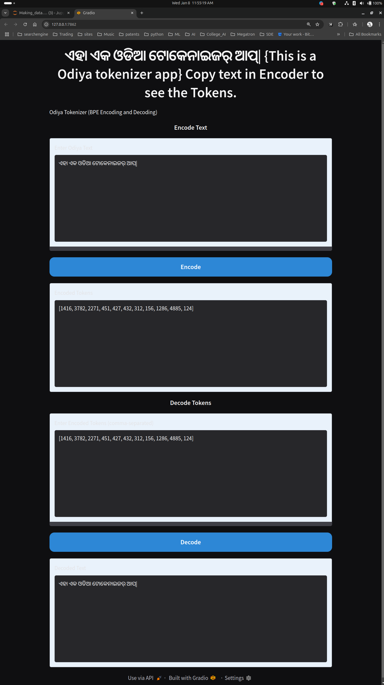

# Tokenizer_BPE (Byte Pair Encoding) | compression ratio: 10.43 X

This project implements a **Byte Pair Encoding (BPE)** tokenizer, useful for subword tokenization in natural language processing (NLP) tasks. The BPE algorithm helps in encoding rare words by breaking them down into frequent subword units, improving vocabulary efficiency. This implementation works with byte sequences and supports training, encoding, decoding, and saving/loading the tokenizer model.

## Features

- **Trainable Tokenizer:** Train a tokenizer based on Byte Pair Encoding (BPE) to split words into frequent subword units.
- **Compression Ratio Tracking:** Monitors and displays the compression ratio during training.
- **Saving/Loading:** Serialize and deserialize the tokenizer model for later use.
- **Efficient Encoding/Decoding:** Convert between text and BPE tokens efficiently.

## Requirements

- Python 3.7+
- `tqdm` for progress bars
- `numpy` for efficient computations
- `pickle` for model saving and loading

Install the required libraries using pip:

```bash
pip install tqdm numpy
```

## Class: `Tokenizer_BPE`

### Constructor: `Tokenizer_BPE(text, vocab_size=5000)`

- Parameters:
  - `text`: The corpus to train the tokenizer on.
  - `vocab_size`: Maximum vocabulary size after training (default is 5000).
- Initializes the corpus and sets the vocabulary size.

### Method: `_get_token_stats(ids)`

- Parameters:
  - `ids`: List of tokenized IDs (byte sequence).
- Returns:
  - `Counter`: A `Counter` object containing the frequency of adjacent token pairs in the sequence.

### Method: `_merge_tokens(ids, pair, new_idx)`

- Parameters:
  - `ids`: List of token IDs to merge the pair.
  - `pair`: The token pair to merge.
  - `new_idx`: New index to assign to the merged pair.
- Returns:
  - `merged_ids`: A list with merged tokens.

### Method: `train()`

- Description:
  - Trains the BPE tokenizer on the given corpus by performing token merges.
  - Keeps track of the vocabulary size and compression ratio.
- Returns:
  - `vocab`: The final vocabulary after training.
  - `merges`: Dictionary mapping token pairs to new indices.

### Method: `encode(text)`

- Parameters:
  - `text`: The text string to encode.
- Returns:
  - `tokens`: The encoded tokens in BPE format (as a list of token IDs).

### Method: `decode(ids)`

- Parameters:
  - `ids`: A list of token IDs to decode.
- Returns:
  - `text`: The decoded text string.

### Method: `save(filepath)`

- Parameters:
  - `filepath`: Path to save the tokenizer model.
- Description:
  - Saves the trained tokenizer’s vocabulary and merge operations to a file using `pickle`.

### Static Method: `load(filepath)`

- Parameters:
  - `filepath`: Path to load the tokenizer model from.
- Returns:
  - A `Tokenizer_BPE` object with the loaded model.


## Usage Example

```python
if __name__ == "__main__":
    with open('cleaned_data.txt', 'r') as file:
        data = file.read()
    example_text = data[:200]
    
    max_vocab_size = 5000
    odiya_tokenizer = Tokenizer_BPE(data,max_vocab_size)
    vocab, merges = odiya_tokenizer.train()
    odiya_tokenizer.save("odiya_tokenizer.pkl")

    loaded_tokenizer = Tokenizer_BPE.load("odiya_tokenizer.pkl")
    print(f"Odiys Text Example : {example_text}")
    encoded = loaded_tokenizer.encode(example_text)
    decoded = loaded_tokenizer.decode(encoded)
    print(f"Encoded Text: {encoded} \n")
    print(f"Decoded the Tokens: {decoded} \n")
    
    if decoded == example_text:
        print("Tokenizer Working Fine !!  <3 \n")
    else:
        print("Tokenizer Not Working Well. Please Chcek the Steps \n")
```

## Output Example

```python
Iteration 1, Compression Ratio 1.44X:   0%|                  | 2/4744 [00:00<03:59, 19.78it/s]
Crossed 1.32 
Iteration 609, Compression Ratio 5.56X:  13%|█▊            | 604/4744 [00:10<00:57, 71.67it/s]
Crossed 5.52 
Iteration 1202, Compression Ratio 6.77X:  25%|███         | 1198/4744 [00:18<00:43, 82.01it/s]
Crossed 6.74 
Iteration 1797, Compression Ratio 7.60X:  38%|████▌       | 1792/4744 [00:25<00:34, 85.40it/s]
Crossed 7.57 
Iteration 2391, Compression Ratio 8.27X:  50%|██████      | 2384/4744 [00:32<00:26, 89.85it/s]
Crossed 8.25 
Iteration 2986, Compression Ratio 8.89X:  63%|███████▌    | 2982/4744 [00:38<00:17, 98.54it/s]
Crossed 8.87 
Iteration 3581, Compression Ratio 9.43X:  75%|████████▎  | 3580/4744 [00:44<00:10, 107.24it/s]
Crossed 9.41 
Iteration 4175, Compression Ratio 9.97X:  88%|█████████▋ | 4168/4744 [00:50<00:05, 110.91it/s]
Crossed 9.96 
Iteration 4743, Compression Ratio 10.43X: 100%|███████████| 4744/4744 [00:54<00:00, 86.29it/s]
++++++++++++++++++++++++++++Final Result ++++++++++++++++++++++++++++
After training: tokens length: 37291
After training: merges length: 4744
After Training Vocab length 5000
compression ratio: 10.43X
Tokenizer saved to odiya_tokenizer.pkl
Odiys Text Example : ପ୍ରଥମ ବିଶ୍ୱ ଓଡିଆ ଭାଷା ସମ୍ମିଳନୀର ଐତିହାସିକ ଦିଗ  ଓଡିଆ ଭାଷାର ପ୍ରଚାର, ପ୍ରସାର ତଥା ଗବେଷଣାକୁ ପ୍ରାଧାନ୍ୟ ଦେବା ପ୍ରଥମ ବିଶ୍ୱ ଓଡିଆ ଭାଷା ସମ୍ମିଳନୀର ପ୍ରଧାନ ଲକ୍ଷ୍ୟ । ଏହି ସମ୍ମିଳନୀ ରାଜ୍ୟ, ଜାତୀୟ ଓ ଅନ୍ତର୍ଜାତୀୟ ସ୍ତରରେ ଆୟୋଜନ
Encoded Text: [4310, 3371, 310, 4312, 369, 830, 32, 1460, 281, 365, 2032, 1260, 3372, 2243, 151, 303, 1048, 304, 338, 467, 2919, 302, 1178, 1179, 759, 3371, 266, 1385, 4313, 1180, 362, 1339, 1633, 2506, 3373, 2920, 4314, 1300, 3375, 276] 

Decoded the Tokens: ପ୍ରଥମ ବିଶ୍ୱ ଓଡିଆ ଭାଷା ସମ୍ମିଳନୀର ଐତିହାସିକ ଦିଗ  ଓଡିଆ ଭାଷାର ପ୍ରଚାର, ପ୍ରସାର ତଥା ଗବେଷଣାକୁ ପ୍ରାଧାନ୍ୟ ଦେବା ପ୍ରଥମ ବିଶ୍ୱ ଓଡିଆ ଭାଷା ସମ୍ମିଳନୀର ପ୍ରଧାନ ଲକ୍ଷ୍ୟ । ଏହି ସମ୍ମିଳନୀ ରାଜ୍ୟ, ଜାତୀୟ ଓ ଅନ୍ତର୍ଜାତୀୟ ସ୍ତରରେ ଆୟୋଜନ 

Tokenizer Working Fine !!  <3 

```


# Compression Ratio and Byte Pair Encoding (BPE)

## Compression Ratio

**Compression Ratio** refers to the reduction in size of the data after it has been processed, relative to its original size. In the context of tokenization and text processing, the compression ratio typically measures how much the text has been reduced in terms of the number of tokens or characters.

### Formula:
The compression ratio is generally calculated as:

Compression Ratio = (Original Size) / (Compressed Size)

- **Original Size**: The number of tokens (or characters) before applying the compression technique (in this case, before BPE).
- **Compressed Size**: The number of tokens (or characters) after applying BPE.

For example, if a piece of text has 100 tokens and after applying BPE it results in 60 tokens, the compression ratio would be:

Compression Ratio = 100 / 60 = 1.67X

A higher compression ratio (greater than 1) indicates that the text has been compressed, meaning that it uses fewer tokens to represent the same information.

---

## Byte Pair Encoding (BPE)

**Byte Pair Encoding (BPE)** is a simple and efficient data compression technique commonly used for tokenizing text in natural language processing (NLP) tasks. The goal of BPE is to break down words into smaller subword units (tokens), which can help handle rare or out-of-vocabulary words by representing them as combinations of more frequent subword units.

### How BPE Works:

1. **Initialization**:
   - The algorithm starts with a list of characters (or bytes) from the corpus as the initial "vocabulary." For example, the word "low" would initially be tokenized as individual characters: `['l', 'o', 'w']`.

2. **Counting Pairs**:
   - The algorithm iteratively counts the frequency of adjacent pairs of tokens (characters or subwords) in the corpus. For example, for the word "low," the pairs would be ('l', 'o') and ('o', 'w').

3. **Merging Pairs**:
   - The most frequent pair of tokens is identified, and it is merged into a new subword (a new token). The pair ('l', 'o') would be merged into a new token `lo`. Now, the word "low" might be represented as `['lo', 'w']`.

4. **Iterative Process**:
   - This merging process is repeated until a predefined vocabulary size is reached or there are no more frequent pairs to merge. Each time a pair is merged, a new token is added to the vocabulary, and the sequence of tokens is updated.

5. **Result**:
   - The result is a vocabulary of subword units that can be used to efficiently encode text. Words that previously did not exist in the vocabulary can now be represented as a combination of subword units that are part of the vocabulary.

### Example of BPE:

low lower new newer

- **Step 1**: Start with individual characters:

low -> ['l', 'o', 'w'] lower -> ['l', 'o', 'w', 'e', 'r'] new -> ['n', 'e', 'w'] newer -> ['n', 'e', 'w', 'e', 'r']

\- **Step 2**: Count pairs:

('l', 'o') -> 2 ('o', 'w') -> 2 ('w', 'e') -> 2 ('e', 'r') -> 2 ('n', 'e') -> 2

- **Step 3**: Merge the most frequent pair ('l', 'o'):

low -> ['lo', 'w'] lower -> ['lo', 'w', 'e', 'r'] new -> ['n', 'e', 'w'] newer -> ['n', 'e', 'w', 'e', 'r']

- **Step 4**: Count pairs again, and repeat the process until the desired vocabulary size is reached.

### Benefits of BPE:
- **Handling Out-of-Vocabulary (OOV) Words**: BPE can handle unseen words by splitting them into known subword units.
- **Vocabulary Efficiency**: BPE reduces the size of the vocabulary by merging the most frequent subword units, resulting in a smaller model size for language tasks.
- **Subword Representation**: It improves language models by enabling them to represent morphemes or meaningful subword units rather than relying on word-level tokenization, which may suffer from rare word issues.


---

## Conclusion

- **Compression Ratio** helps measure the effectiveness of a tokenizer by evaluating how much the size of the tokenized text has been reduced.
- **Byte Pair Encoding (BPE)** is an efficient way to tokenize text by merging frequent character pairs into subword units, helping with vocabulary reduction and handling out-of-vocabulary words.

BPE is widely used in many NLP models, including machine translation, language modeling, and text generation, as it provides a balance between character-level and word-level tokenization.


# Odiya Text Tokenizer App

This app provides an interactive interface to encode and decode Odiya text using a pre-trained Byte Pair Encoding (BPE) tokenizer. The app allows users to enter Odiya text, tokenize it into tokens, and also decode the tokens back into the original text. The interface is built using Gradio and leverages a custom tokenizer model.

## Features

- **Encode Odiya Text:** Convert Odiya text into a sequence of tokens using the Byte Pair Encoding (BPE) tokenizer.
- **Decode Tokens:** Convert a sequence of tokens (comma-separated) back into readable Odiya text.
- **Interactive Interface:** The app features a user-friendly interface built with Gradio that includes input and output sections for both encoding and decoding functionalities.

## Requirements

To run the app locally, you will need:

- Python 3.x
- `gradio`: To build and deploy the app interface
- `Tokenizer_BPE`: A pre-trained tokenizer library for encoding and decoding text (make sure `odiya_tokenizer.pkl` is available)

You can install the required libraries by running:

```bash
pip install gradio
```

