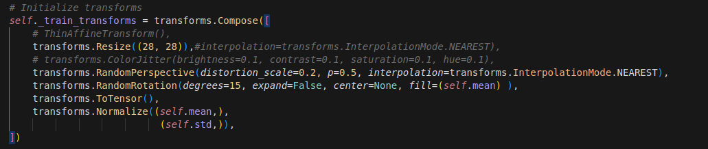
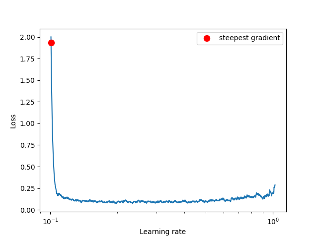
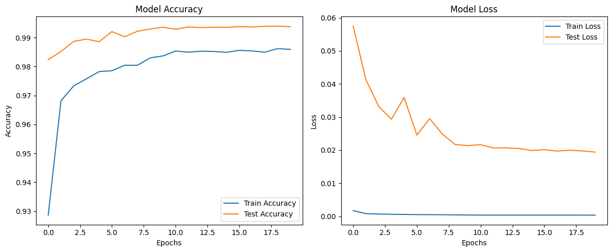
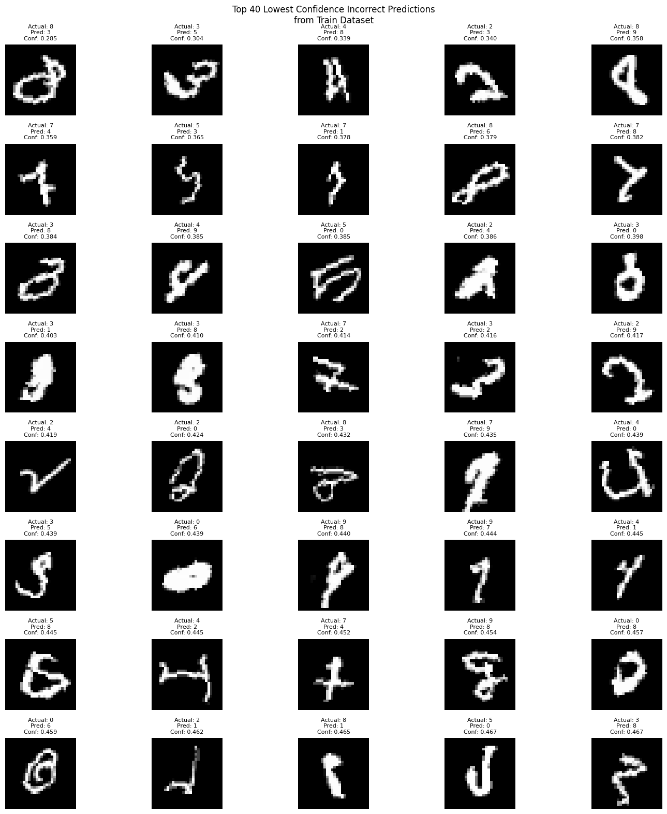
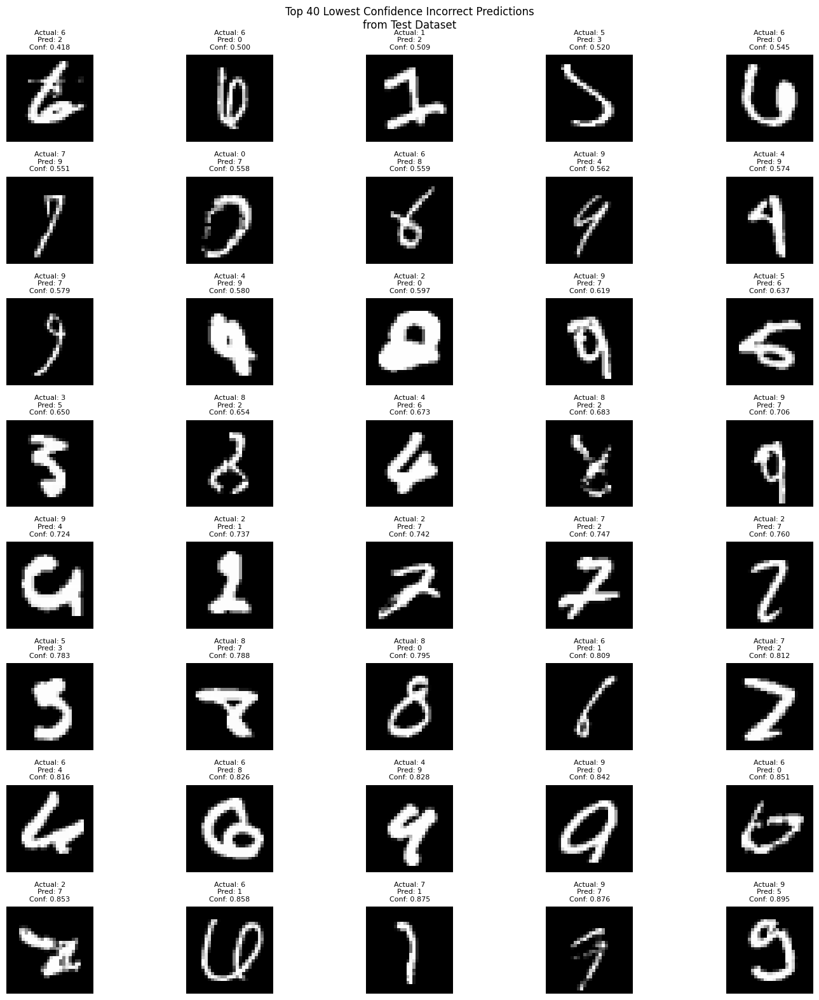
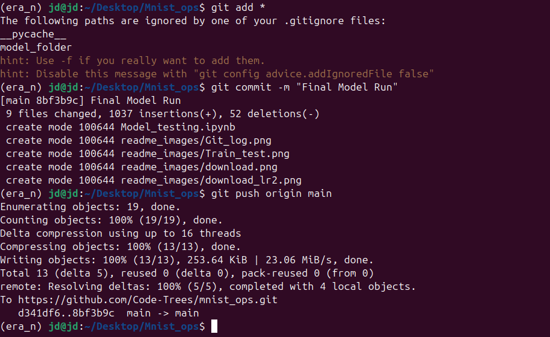
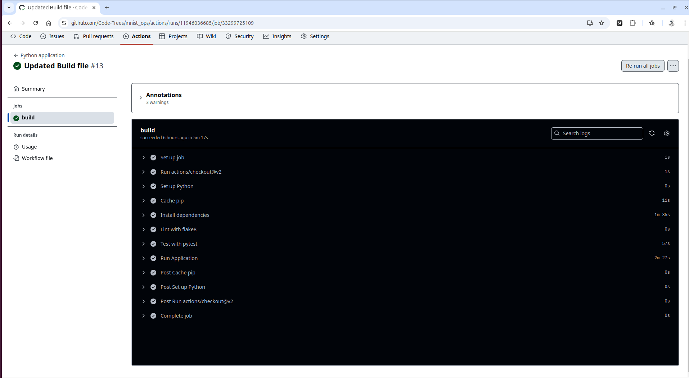

# Target: Achieve 99.4 in Less than 20 epochs and 10k parameters


## Model Architecture

This deep learning model is a Convolution Neural Network (CNN) designed for image classification tasks. The architecture is inspired by many people with additional modifications for improved performance.

### Key Features:
- Automatic data scaling
- Batch normalization layers for stable training
- Dropout layers for regularization
- Softmax activation for multi-class classification
- Less parameter-based model, best performance
- LR-Finder / Scheduler for faster training
- Modularized code for easy maintenance
- Test cases for GitHub action deployment
- CPU and GPU-based training

### Architecture Details:

```python
----------------------------------------------------------------
        Layer (type)               Output Shape         Param #
================================================================
            Conv2d-1           [-1, 10, 26, 26]              90
       BatchNorm2d-2           [-1, 10, 26, 26]              20
           Dropout-3           [-1, 10, 26, 26]               0
              ReLU-4           [-1, 10, 26, 26]               0
            Conv2d-5           [-1, 10, 24, 24]             900
       BatchNorm2d-6           [-1, 10, 24, 24]              20
           Dropout-7           [-1, 10, 24, 24]               0
              ReLU-8           [-1, 10, 24, 24]               0
            Conv2d-9           [-1, 10, 22, 22]             900
      BatchNorm2d-10           [-1, 10, 22, 22]              20
          Dropout-11           [-1, 10, 22, 22]               0
             ReLU-12           [-1, 10, 22, 22]               0
           Conv2d-13           [-1, 10, 20, 20]             900
      BatchNorm2d-14           [-1, 10, 20, 20]              20
          Dropout-15           [-1, 10, 20, 20]               0
             ReLU-16           [-1, 10, 20, 20]               0
        MaxPool2d-17           [-1, 10, 10, 10]               0
           Conv2d-18             [-1, 10, 8, 8]             900
      BatchNorm2d-19             [-1, 10, 8, 8]              20
          Dropout-20             [-1, 10, 8, 8]               0
             ReLU-21             [-1, 10, 8, 8]               0
           Conv2d-22             [-1, 16, 6, 6]           1,440
      BatchNorm2d-23             [-1, 16, 6, 6]              32
          Dropout-24             [-1, 16, 6, 6]               0
             ReLU-25             [-1, 16, 6, 6]               0
           Conv2d-26             [-1, 16, 4, 4]           2,304
      BatchNorm2d-27             [-1, 16, 4, 4]              32
          Dropout-28             [-1, 16, 4, 4]               0
             ReLU-29             [-1, 16, 4, 4]               0
        AvgPool2d-30             [-1, 16, 1, 1]               0
           Conv2d-31             [-1, 10, 1, 1]             160
================================================================
Total params: 7,758
Trainable params: 7,758
Non-trainable params: 0
----------------------------------------------------------------
Input size (MB): 0.00
Forward/backward pass size (MB): 0.70
Params size (MB): 0.03
Estimated Total Size (MB): 0.74
----------------------------------------------------------------
```

### Model Parameters
- Total Parameters: 7.7K
- Trainable Parameters: 7.7K
- Input Shape: `(1, 28, 28)`
- Output Classes: 10

## Data Augmentation Pipeline

### Image Augmentation Techniques



After Looking at data I have comeup with this Augmentation . Also The sequence of augmentation matters because 

1. **`transforms.Resize((28, 28))`**:
   - Ensures all images are resized to a uniform size (28x28), which is often required for neural networks to maintain consistent input dimensions.
   - Interpolation mode like `NEAREST` helps retain sharp edges, suitable for datasets like MNIST.
2. **(Optional) `transforms.ColorJitter`**:
   - Introduces variations in brightness, contrast, saturation, and hue to make the model robust to different lighting conditions (currently commented out in your code).
3. **`transforms.RandomPerspective`**:
   - Applies a random perspective distortion to simulate variations in viewpoint or perspective.
   - Adds diversity to training data and improves generalization, especially for datasets with handwritten or irregular shapes.
4. **`transforms.RandomRotation`**:
   - Rotates the image randomly within a specified range (±15° in this case).
   - Helps the model handle rotated versions of objects, useful for tasks where orientation might vary.
   - The `fill` parameter ensures the new background introduced during rotation is filled with a specified value (like `self.mean`).
5. **`transforms.ToTensor()`**:
   - Converts the image into a PyTorch tensor and scales pixel values to [0,1][0,1].
6. **`transforms.Normalize((self.mean,), (self.std,))`**:
   - Normalizes the image tensor to have a mean of `0` and a standard deviation of `1`, using the dataset's `mean` and `std`.
   - Ensures consistent input range and accelerates convergence during training.

## Model Running Pipeline

### LR Finders

for 100 Iter:

```python
100%|███████████████████████████████████████████████████████████████████████████████████████████████████████████████████████████████████████████| 100/100 [00:01<00:00, 64.31it/s]
Learning rate search finished. See the graph with {finder_name}.plot()
LR suggestion: steepest gradient
Suggested LR: 1.01E-01
Loss: 0.07299442993729771 LR: 0.10073514187592006
[0.10073514187592006]
```




The model will automatic pick the Best learning rate . For Small models like MNIST it is not so important. But for bigger model it is going to save real money by reducing your training time 

### Training Epochs

```python
Train ==> Epochs: 0 Batch:  468 loss: 0.19688920676708221 Accuracy: 92.83% : 100%|██████████████████████████| 469/469 [00:06<00:00, 70.79it/s]
Test ==> Epochs: 0 Batch:  78 loss: 0.049452270951867106 Accuracy: 98.25% : 100%|████████████████████████████| 79/79 [00:00<00:00, 138.42it/s]
Insufficient test accuracy data.
LR: 0.10073514187592006

Train ==> Epochs: 1 Batch:  468 loss: 0.11956565827131271 Accuracy: 96.84% : 100%|██████████████████████████| 469/469 [00:05<00:00, 82.20it/s]
Test ==> Epochs: 1 Batch:  78 loss: 0.033171773017942906 Accuracy: 98.93% : 100%|████████████████████████████| 79/79 [00:00<00:00, 180.69it/s]
Conditions not met for saving the model.
LR: 0.10073514187592006

Train ==> Epochs: 2 Batch:  468 loss: 0.05977429449558258 Accuracy: 97.39% : 100%|█████████████████████████| 469/469 [00:04<00:00, 107.13it/s]
Test ==> Epochs: 2 Batch:  78 loss: 0.03193045979142189 Accuracy: 99.04% : 100%|█████████████████████████████| 79/79 [00:00<00:00, 192.42it/s]
Conditions not met for saving the model.
LR: 0.10073514187592006

Train ==> Epochs: 3 Batch:  468 loss: 0.10074038058519363 Accuracy: 97.66% : 100%|█████████████████████████| 469/469 [00:04<00:00, 108.03it/s]
Test ==> Epochs: 3 Batch:  78 loss: 0.03222498789578676 Accuracy: 98.88% : 100%|█████████████████████████████| 79/79 [00:00<00:00, 183.16it/s]
Conditions not met for saving the model.
LR: 0.10073514187592006

Train ==> Epochs: 4 Batch:  468 loss: 0.04077999293804169 Accuracy: 97.80% : 100%|█████████████████████████| 469/469 [00:04<00:00, 105.11it/s]
Test ==> Epochs: 4 Batch:  78 loss: 0.028558301972597837 Accuracy: 99.17% : 100%|████████████████████████████| 79/79 [00:00<00:00, 190.51it/s]
Conditions not met for saving the model.
LR: 0.10073514187592006

Train ==> Epochs: 5 Batch:  468 loss: 0.020864875987172127 Accuracy: 97.97% : 100%|████████████████████████| 469/469 [00:04<00:00, 109.40it/s]
Test ==> Epochs: 5 Batch:  78 loss: 0.02475109224896878 Accuracy: 99.26% : 100%|█████████████████████████████| 79/79 [00:00<00:00, 186.56it/s]
Conditions not met for saving the model.
LR: 0.10073514187592006

Train ==> Epochs: 6 Batch:  468 loss: 0.07768300920724869 Accuracy: 97.94% : 100%|█████████████████████████| 469/469 [00:04<00:00, 108.36it/s]
Test ==> Epochs: 6 Batch:  78 loss: 0.027616122114658356 Accuracy: 99.06% : 100%|████████████████████████████| 79/79 [00:00<00:00, 192.45it/s]
Conditions not met for saving the model.
LR: 0.10073514187592006

Train ==> Epochs: 7 Batch:  468 loss: 0.0749334767460823 Accuracy: 98.00% : 100%|██████████████████████████| 469/469 [00:04<00:00, 109.52it/s]
Test ==> Epochs: 7 Batch:  78 loss: 0.025097812125831842 Accuracy: 99.20% : 100%|████████████████████████████| 79/79 [00:00<00:00, 190.02it/s]
Conditions not met for saving the model.
LR: 0.0010073514187592006

Train ==> Epochs: 8 Batch:  468 loss: 0.04955771192908287 Accuracy: 98.32% : 100%|█████████████████████████| 469/469 [00:04<00:00, 107.53it/s]
Test ==> Epochs: 8 Batch:  78 loss: 0.021912441154941918 Accuracy: 99.33% : 100%|████████████████████████████| 79/79 [00:00<00:00, 187.42it/s]
Target Achieved: 99.33% Test Accuracy!!
LR: 0.0010073514187592006

Train ==> Epochs: 9 Batch:  468 loss: 0.0336441844701767 Accuracy: 98.38% : 100%|██████████████████████████| 469/469 [00:04<00:00, 103.17it/s]
Test ==> Epochs: 9 Batch:  78 loss: 0.020946861810609698 Accuracy: 99.34% : 100%|████████████████████████████| 79/79 [00:00<00:00, 182.53it/s]
Target Achieved: 99.34% Test Accuracy!!
LR: 0.0010073514187592006

Train ==> Epochs: 10 Batch:  468 loss: 0.01676121912896633 Accuracy: 98.48% : 100%|████████████████████████| 469/469 [00:04<00:00, 103.81it/s]
Test ==> Epochs: 10 Batch:  78 loss: 0.020509712095558644 Accuracy: 99.37% : 100%|███████████████████████████| 79/79 [00:00<00:00, 182.75it/s]
Target Achieved: 99.37% Test Accuracy!!
LR: 0.0010073514187592006

Train ==> Epochs: 11 Batch:  468 loss: 0.028730293735861778 Accuracy: 98.50% : 100%|███████████████████████| 469/469 [00:04<00:00, 108.99it/s]
Test ==> Epochs: 11 Batch:  78 loss: 0.020016313429176806 Accuracy: 99.38% : 100%|███████████████████████████| 79/79 [00:00<00:00, 184.81it/s]
Target Achieved: 99.38% Test Accuracy!!
LR: 0.0010073514187592006

Train ==> Epochs: 12 Batch:  468 loss: 0.06556940823793411 Accuracy: 98.48% : 100%|████████████████████████| 469/469 [00:04<00:00, 105.77it/s]
Test ==> Epochs: 12 Batch:  78 loss: 0.020281451302627103 Accuracy: 99.35% : 100%|███████████████████████████| 79/79 [00:00<00:00, 183.82it/s]
Conditions not met for saving the model.
LR: 0.0010073514187592006

Train ==> Epochs: 13 Batch:  468 loss: 0.02121802233159542 Accuracy: 98.47% : 100%|████████████████████████| 469/469 [00:04<00:00, 108.17it/s]
Test ==> Epochs: 13 Batch:  78 loss: 0.01943939655125141 Accuracy: 99.38% : 100%|████████████████████████████| 79/79 [00:00<00:00, 185.10it/s]
Conditions not met for saving the model.
LR: 0.0010073514187592006

Train ==> Epochs: 14 Batch:  468 loss: 0.042149707674980164 Accuracy: 98.47% : 100%|███████████████████████| 469/469 [00:04<00:00, 104.04it/s]
Test ==> Epochs: 14 Batch:  78 loss: 0.019514731518924237 Accuracy: 99.40% : 100%|███████████████████████████| 79/79 [00:00<00:00, 183.54it/s]
Target Achieved: 99.40% Test Accuracy!!
LR: 0.0010073514187592006

Train ==> Epochs: 15 Batch:  468 loss: 0.02281080186367035 Accuracy: 98.55% : 100%|████████████████████████| 469/469 [00:04<00:00, 108.98it/s]
Test ==> Epochs: 15 Batch:  78 loss: 0.018949265101645144 Accuracy: 99.39% : 100%|███████████████████████████| 79/79 [00:00<00:00, 194.91it/s]
Conditions not met for saving the model.
LR: 0.0010073514187592006

Train ==> Epochs: 16 Batch:  468 loss: 0.01786264218389988 Accuracy: 98.63% : 100%|████████████████████████| 469/469 [00:04<00:00, 107.17it/s]
Test ==> Epochs: 16 Batch:  78 loss: 0.019375051283836365 Accuracy: 99.41% : 100%|███████████████████████████| 79/79 [00:00<00:00, 187.60it/s]
Target Achieved: 99.41% Test Accuracy!!
LR: 0.0010073514187592006

Train ==> Epochs: 17 Batch:  468 loss: 0.027132613584399223 Accuracy: 98.54% : 100%|███████████████████████| 469/469 [00:04<00:00, 106.48it/s]
Test ==> Epochs: 17 Batch:  78 loss: 0.01861437407983467 Accuracy: 99.45% : 100%|████████████████████████████| 79/79 [00:00<00:00, 176.50it/s]
Target Achieved: 99.45% Test Accuracy!!
LR: 0.0010073514187592006

Train ==> Epochs: 18 Batch:  468 loss: 0.08461489528417587 Accuracy: 98.57% : 100%|████████████████████████| 469/469 [00:04<00:00, 104.51it/s]
Test ==> Epochs: 18 Batch:  78 loss: 0.018680091229081153 Accuracy: 99.46% : 100%|███████████████████████████| 79/79 [00:00<00:00, 192.73it/s]
Target Achieved: 99.46% Test Accuracy!!
LR: 0.0010073514187592006

Train ==> Epochs: 19 Batch:  468 loss: 0.04130764305591583 Accuracy: 98.54% : 100%|████████████████████████| 469/469 [00:04<00:00, 105.73it/s]
Test ==> Epochs: 19 Batch:  78 loss: 0.01865274486616254 Accuracy: 99.44% : 100%|████████████████████████████| 79/79 [00:00<00:00, 181.38it/s]
Conditions not met for saving the model.
LR: 0.001

Max Train Accuracy:  0.9863166666666666
Max Test Accuracy:  0.9946

```

- Learning rate annealing helped prevent over fitting.



## Why Model Not able to predict 100% of data in test set .

After looking at data , I have realized that the Training set and test set have some data Which is difficult to predict by human eye . 

That is where the model is learning garbage. But This doest the work  and Fulfill out target,

#### Train Model Wrong Predicted Images with 40 lowest confidence



#### Test model Wrong Predicted Images with  40 lowest confidence 



### Deployment

**Test cases**

Test case help to validate that I am pushing Correct information to  repo. Let's test it locally:

```python
============================= test session starts ==============================
platform linux -- Python 3.12.7, pytest-8.3.3, pluggy-1.5.0 -- /bin/python
cachedir: .pytest_cache
rootdir: Mnist_ops
plugins: anyio-4.6.2.post1
collected 11 items                                                             

tests/test_model.py::test_model_param_count PASSED                       [  9%]
tests/test_model.py::test_model_output_shape PASSED                      [ 18%]
tests/test_model.py::test_cuda_available PASSED                          [ 27%]
tests/test_model.py::test_batch_size PASSED                              [ 36%]
tests/test_model.py::test_calculate_stats PASSED                         [ 45%]
tests/test_model.py::test_transformations PASSED                         [ 54%]
tests/test_model.py::test_dataloader_args PASSED                         [ 63%]
tests/test_model.py::test_data_loaders PASSED                            [ 72%]
tests/test_model.py::test_data_augmentation PASSED                       [ 81%]
tests/test_model.py::test_training PASSED                                [ 90%]
tests/test_model.py::test_training_with_scheduler PASSED                 [100%]

============================= 11 passed in 36.37s ==============================
```


## Push to git hub with Git action configured






**Git Action logs**

**LR finder**

 94%|█████████▍| 945/1000 [01:04<00:03, 14.64it/s]

Stopping early, the loss has diverged

Learning rate search finished. See the graph with {finder_name}.plot()

LR suggestion: steepest gradient

Suggested LR: 3.12E-02

Loss: 0.31175027199026456 LR :0.031152542235554845


**Training/Testing Loop:**

Train ==> Epochs: 0 Batch:  937 loss: 0.03763921186327934 Accuracy: 90.91% : 100%|██████████| 938/938 [01:05<00:00, 15.51it/s]

Train ==> Epochs: 0 Batch:  937 loss: 0.03763921186327934 Accuracy: 90.91% : 100%|██████████| 938/938 [01:05<00:00, 14.35it/s]


Test ==> Epochs: 0 Batch:  156 loss: 0.0016227789369411766 Accuracy: 96.75% : 100%|██████████| 157/157 [00:08<00:00, 19.35it/s]

Insufficient test accuracy data.

LR: 0.031152542235554845

Max Train Accuracy:  0.9090833333333334

Max Test Accuracy:  0.9675

## Git Action logs: Passed


## Requirements

- torch>=2.4.1 --index-url https://download.pytorch.org/whl/cpu
- torchvision>=0.19.1 --index-url https://download.pytorch.org/whl/cpu
- Albumentations 1.1.0
- NumPy 1.21+
- OpenCV 4.5+
- CUDA 11.3+ (for GPU support ONLY)

